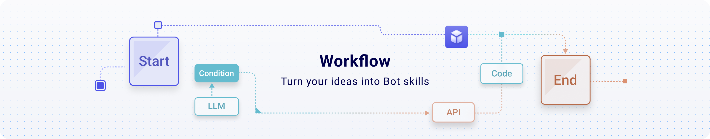

# 1. 了解 AI 工作流

# **了解 AI 工作流**

> 创作者：ou_3244eb92a1c8ab016b813dbe14262d39

## 什么是工作流？

工作流（Workflow）是指完成一项任务或目标时，按照特定顺序进行的一系列活动或步骤。强调在计算机应用环境下的自动化。

**工作流**就像是一条流水线，把复杂的任务拆分成多个简单的步骤，每一步都有明确的目标和流程。

**举例说明：**

**包子铺**的工作流是一个标准化、重复性的过程，适合用来展示工作流的特点。步骤包括：

> **准备原料**：采购和准备材料。
> **和面**：制作面团。
> **制作馅料**：准备馅料。
> **制作包子皮：**擀皮。
> **包制包子**：包好包子。
> **蒸包子**：蒸制包子。
> **包装和销售**：包装并销售。

每个步骤都需要按顺序进行，重复执行，确保每个包子都符合标准。工作流的目标是通过规范化每一个步骤，确保高效、稳定地完成整个过程。

**输入和输出的概念 【**** ****较为重要**** ****】**

在工作流中，上一步的输出通常是下一步的输入。例如，在“和面”步骤，面团来自于“准备原料”的输出，完成的面团则是下一步“擀包子皮”的输入。

当你设计好“包子铺”工作流后，只需启动工作流，每个步骤将自动依序运行，直到包子全部制作完成。这样你可以将一个好的想法，通过工作流自动化地执行。

## 为什么要用工作流？

> [!TIP]
> 在 AI 领域， AI 智能体（AI Agent）的概念很火，许多同学也尝试搭建了智能体。那么智能体和工作流的区别是什么，**为什么我们要使用工作流而非智能体呢？**

智能体和工作流的区别？

**智能体（AI Agent）**

- **是什么**：智能体是一个自动化的“助手”，用来执行特定任务。就像你设置一个闹钟，它帮你在指定时间提醒你。
- **能做什么**：它擅长做一些具体的、重复性的任务，比如客服聊天、推荐商品、处理订单等。
- **缺点**：它只能按照预先设定的规则和任务来做事，如果遇到超出范围的情况，它就不知道怎么办了。

**工作流（Workflow）**

- **是什么**：工作流是一系列任务的流程，决定了每个步骤应该做什么，就像一本操作指南，告诉你从头到尾要怎么做。
- **能做什么**：工作流可以处理一个完整的过程，比如从客户下单、付款到发货和售后服务，涵盖了所有步骤和环节。
- **优点**：它更灵活，能够适应变化。你可以调整步骤和规则来应对不同的情况，不需要一开始就固定下来。

**区别总结**

- **智能体**是特定任务的“助手”，用于局部执行任务。
- **工作流**是一个“计划”或“路线图”，指导整个任务的流程。

**简单说，**工作流是全局的，智能体是局部的。

在业务中，通常需要的是工作流而非单个智能体，因为整个业务流程设计至关重要。例如，在烹饪中，关键不在于使用多贵的锅，而是按步骤完成每道工序。

因此，工作流才是解决问题的关键，它帮助优化思路、提升效率。设计好工作流才能大幅提升整体业务效率。

## **什么样的业务适合工作流？**

适合工作流化的业务一般具备以下特点：

1. **重复性工作多**：业务中的任务或流程高度重复。
2. **业务流程固定**：步骤相对固定，且具有标准化的操作流程。

我们以一个自媒体工作者的日常来举例，
自媒体工作者的日常任务包括更新内容、获取播放量、获得关注和客户线索。常见的工作流步骤如下：

1. **内容策划**（市场调研 + 创意构思）
2. **内容创作**（素材收集 + 内容制作）
3. **内容编辑**（初步编辑 + 设计排版）
4. **内容审核**
5. **内容发布**
6. **互动**（RPA）
7. **效果分析和优化**

这个工作流具备了：**大量的重复性任务**（如内容创作、编辑、发布）和**固定的业务流程**（如策划、创作、审核、发布）。通过 AI 来标准化这些步骤，并利用工具自动执行这些流程，就可以大大提高效率。

如果你是这位自媒体工作者，你会发现，你多出了更多的时间和精力去思考和创造。例如，你可以把时间放在创作高质量内容上，或者基于工作流之上有什么更好的变现方式，而不是天天想着什么时候蹭热点、怎么剪辑等琐事，因为琐事已经由工作流替你干完啦。它让你**释放创造力，更专注核心业务。**

> [!TIP]
> **用老板心态大胆想象一下，把你目前赚钱手段 AI 工作流化外包给  AI，你接下来需要做什么？**

## **狭义工作流 VS 广义工作流**

**狭义工作流**：解决单一环节或任务的自动化。

**广义工作流**：涵盖整个业务流程的自动化。

一般来说，狭义的工作流是解决某个局部的场景，广义的则是解决整个业务流程的问题。

用电商和自媒体两个领域来举例：

- **电商**

  - **狭义**：自动改写商品标题或详情。
  - **广义**：从商品发布、上架到客服、发货全流程的自动化管理。
- **自媒体**

  - **狭义**：生成一篇公众号文章。
  - **广义**：从账号登录、内容撰写、排版到发布和留言回复的全流程自动化。

广义工作流等同于业务流的自动化，通常还会涉及 RPA（机器人流程自动化）、知识库和 Python 等工具。

> [!TIP]
> 工作流和游泳一样，看介绍会觉得枯燥，但一旦你根据自己的需要搭建完成工作流，且成功 RUN 起来，那种欣喜是无法言喻的。

## 常见的工作流与** Agent **开发平台

创作者：ou_63c194debbed4902e13702dc8df4b3c7

由于篇幅有限，补充放在了[常见的 Workflow 与 Agent 开发平台的补充](https://zxdwhda-share.feishu.cn/wiki/JiHMwTWWJiAwObk9j1yccMA9nmf?from=from_copylink)

### AI **Workflow 开发平台**

#### Coze:

新一代 AI Bot 开发平台，集成了丰富的插件工具

国际版：

国内版：

#### Dify:

开源平台，支持自定义和插件

#### 腾讯元器

#### FastGPT:

国内知名，支持自定义流程

#### 影刀&zapier

#### Leap

#### Betteryeah:

立足 RPA 场景，用 AI 将用户需求生成工作流，并通过 RPA 自动化

- 产品形态与 Coze 相似，企业级的 AI 应用开发平台，无论团队编程技能如何，都能快速创建由 AI 驱动的 Agents、知识库、工作流和任务。

#### Flowise:

快速实现智能体搭建

 

#### BISHENG

[快速入门](https://dataelem.feishu.cn/wiki/ZxW6wZyAJicX4WkG0NqcWsbynde?from=from_copylink)

主攻 tob 场景的开源 LLM 搭建平台，与 fastgpt 功能类似，但面向的客户不同，整体功能和部署成本更重。

### **Agent 构建平台**

#### 豆包

#### 文心一言

#### 星火助手

#### kimi.ai

> [!TIP]
> **因为 Coze 具有拓展强、好上手、不用出国等优点，因此本教程的工作流以 Coze 为主。**
