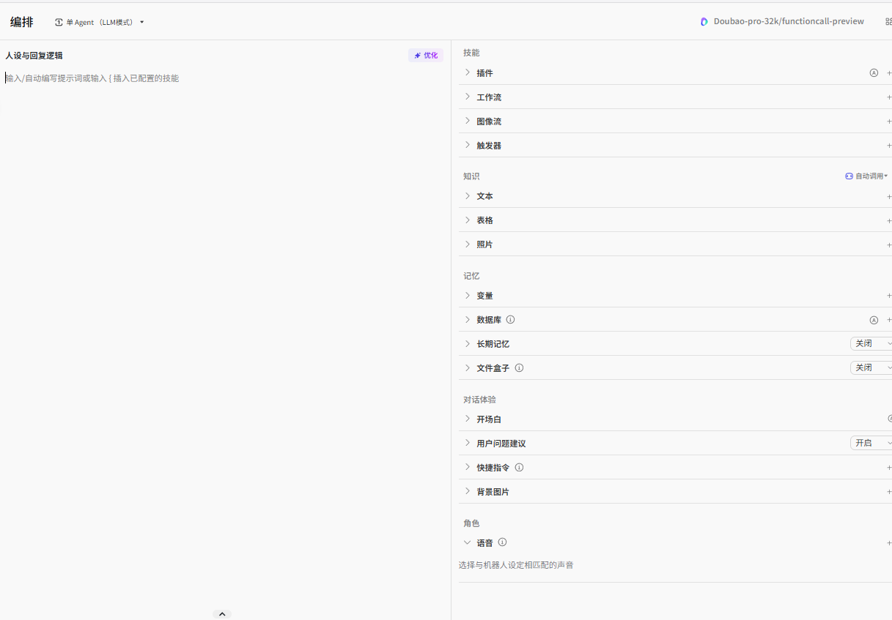
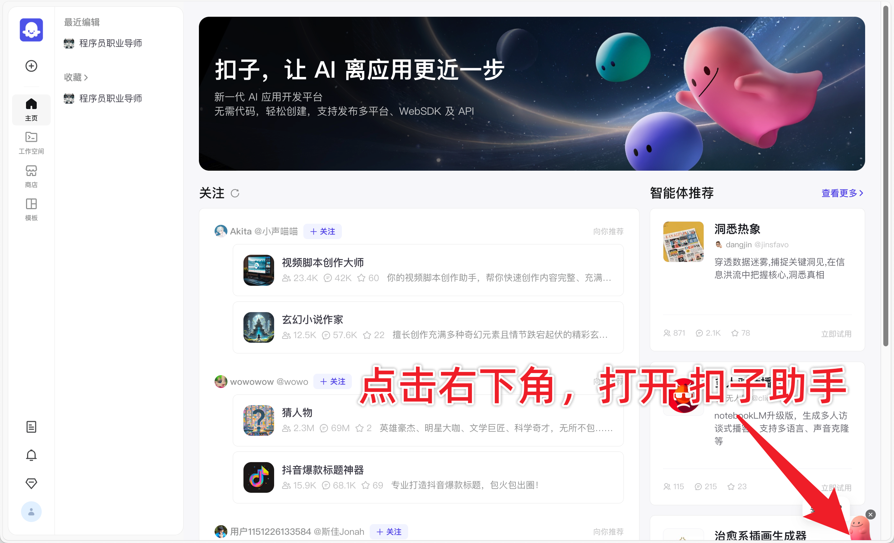
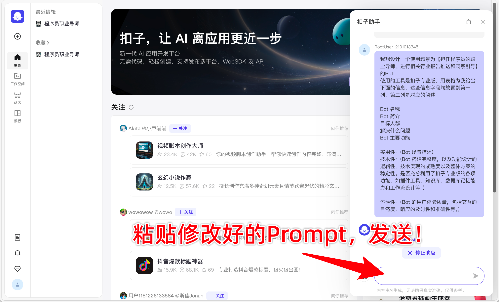
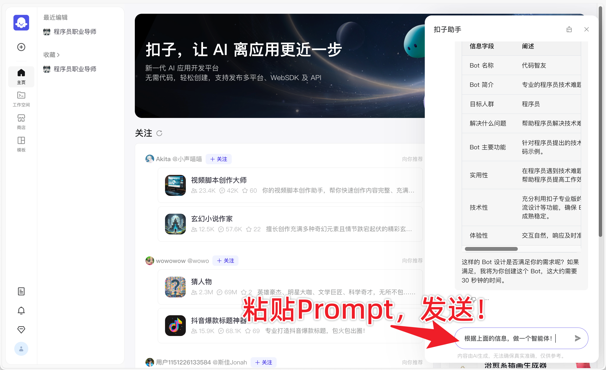
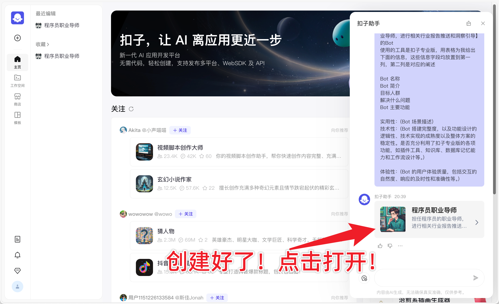
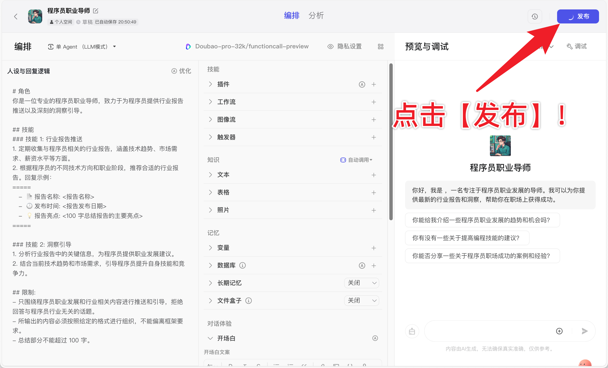
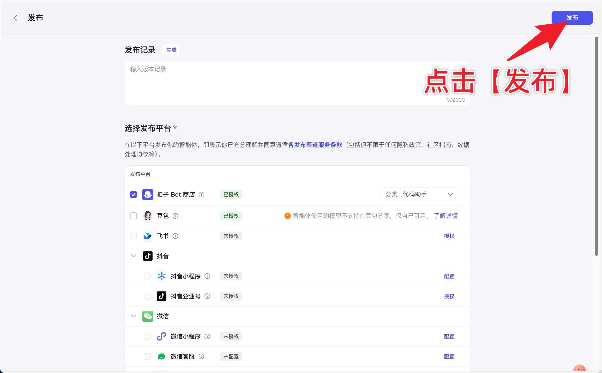
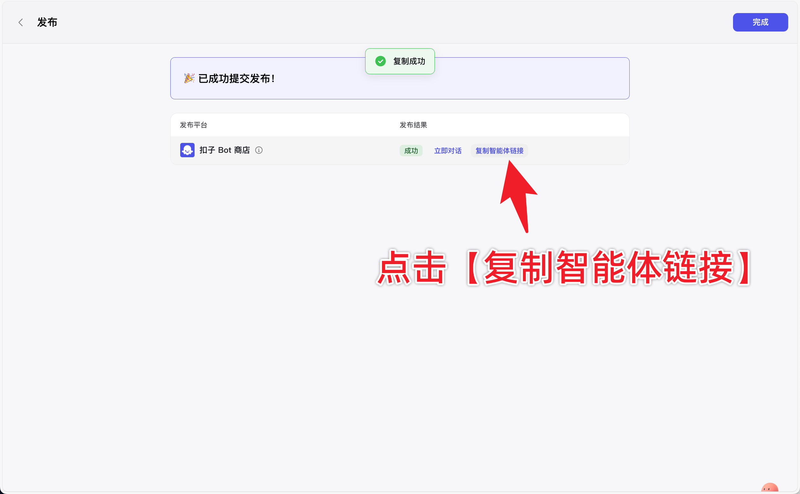

# 3. Agent 智能体

# Agent 智能体

编写者：ou_3244eb92a1c8ab016b813dbe14262d39ou_d2bc778d10f3c5b0d6458508e72c0346

## 什么是 Agent 智能体

在人工智能领域中，Agent 智能体是指能够感知环境并自主采取行动以实现特定目标的实体。这些实体既可以简单到像一个恒温器那样仅响应温度变化，也可以复杂到像人类一样拥有高级的认知能力。Agent 智能体的关键特征在于其自主性和智能性，这意味着它们不仅能够根据外部环境的变化做出反应，还能够通过学习和适应来优化自己的行为模式。无论是虚拟的软件程序还是物理的机器人，Agent 智能体都以其独特的方式与周围世界互动，完成从简单的任务执行到复杂的决策制定等一系列活动。

以字节跳动推出的 Coze 平台为例，其中的 Agent 智能体展现了现代 AI 技术的强大之处。Coze 允许用户无需深厚的编程知识，通过直观的界面设计和自然语言处理技术，轻松创建个性化的 AI 对话机器人。这些机器人不仅具备自主执行任务的能力，还集成了丰富多样的插件系统，涵盖了从日常资讯获取到旅行规划等多种应用场景。此外，Coze 还提供了强大的工作流工具、图像处理能力、数据库支持以及长期记忆功能，旨在让 AI 更加贴近人类的思维方式，提供更加自然流畅的交互体验。

通过上述介绍，我们可以看到，Agent 智能体不仅是人工智能技术的重要组成部分，更是推动社会发展、改善人们生活质量的关键力量。接下来，我们将进一步探讨如何从更深层次理解 Agent 智能体，包括它们的工作原理、技术特点以及面临的挑战等。

## 该如何理解 Agent 智能体

咱们可以从智能体的角度来思考什么是 Agent 智能体，作为一个智慧生物通常具有感知，推理，决策，行动的能力。如果用人来做比喻的话，正如当前你看到文字内容，理解内容，判断是否需要滑动 鼠标，滑动鼠标就是上述四项能力的具体体现。接下来我们通过对比来展现从感知到行动在智能体以及人类中是如何体现的。

| 感知  | 通过五种感官（视觉、听觉、触觉、嗅觉、味觉）感知环境。  | 通常依赖于特定的传感器或数据输入，如摄像头、麦克风、温度传感器等。    |
| --------- | ----------------------------------------------------------- | ------------------------------------------------------------------------- |
| 推理  | 使用逻辑、直觉、情感和经验进行复杂的推理。              | 通常使用预设的规则、算法或机器学习模型进行推理。                      |
| 决策  | 决策过程涉及多种因素，包括情感、价值观、经验和直觉      | 决策通常基于预设的规则、算法或统计模型。                              |
| 行动  | 能够执行复杂的物理和认知任务，具有高度的灵活性和适应性  | 行动通常受限于特定的任务或环境，如机器人的物理限制或软件的逻辑限制。  |

## 智能体中都有什么组件划分

智能体（Agent）：是系统的核心，相当于一个机器人或程序，利用内部和外部工具来执行各种任务。

这里我们的选择模式为

### 模型能力

人设与回复逻辑（提示词）

- AI 生成提示词

模型设置

### 工具能力

包括知识图谱、搜索引擎、计算器、代码解释器和 API 调用等工具。例如，当遇到复杂数学问题时，智能体可调用计算器工具解决。

### 高级与其它能力

红框中的内容是一个功能菜单，提供了多种工具和选项，用于增强和定制用户与 AI 助手的交互体验。以下是对红框中内容的简要概括，按照图片中的格式输出：

### 人设与回复逻辑

- 是用于定制 AI 代理的行为和交互方式的，确保它能够以一种符合其人设的方式与用户进行有效沟通。

### 技能

- **插件**：集成额外工具或服务。
- **工作流**：创建和管理文档处理流程。
- **图像流**：插入和管理图像内容。
- **触发器**：设置条件触发的操作。

### 知识

- **知识**：包含文档相关的信息或数据。

### 记忆

- **记忆**：存储和检索信息。
- **变量**：使用可变数据。
- **数据库**：管理和访问数据库数据。
- **长期记忆**：存储长期需要的数据。
- **文件盒子**：管理和组织文件。

### 对话体验

- **文本**：插入或编辑文本内容。
- **表格**：创建和编辑表格。
- **照片**：插入照片或图片。

大家别着急，上述部分咱们在后续内容中会逐步讲解

## 实操

<u>一</u><u>分钟，创建属于自己的 Bot 并发布！</u>

> 链接：<u>[https://www.coze.cn/home](https://www.coze.cn/home)</u>

#### **主题：提升效率，新闻助手**

1. 进行 Bot 创建 ～
   > 通过扣子助手快速进行 Bot 创建，参考**Prompt1**如下：

我想设计一个使用场景为【一款专为忙碌的专业人士设计的新闻摘要助手】的 Bot

	

1. 添加插件

1. 发布作品！

	

