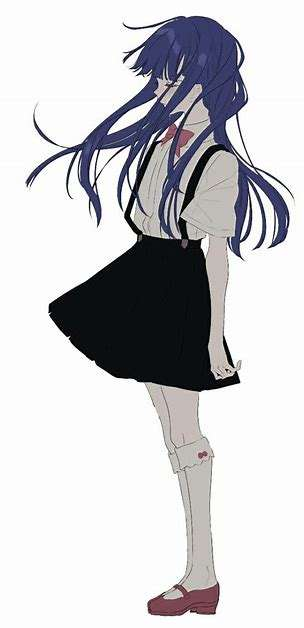

# 7. 图像流（案例分析）

# 图像流 Tutorial（based on coze）

> 创作者：ou_3640575e81fb69cafb304e5743a5a35b@

## 🖼️ AI 绘画应用

### 🖼️ 扣子（Coze）图像流的创建及使用

在 🖼️ AI 绘画应用中，“图像流”通常指由图像生成系统根据用户的输入需求连续生成的一系列图像，形成具有动态变化或特定风格的视觉序列。

这种连续的图像生成方式被称为“图像流”，可以在不同的应用场景下生成变化的或风格一致的图像。本次我们使用的核心 Coze（扣子）平台上可以使用这一功能，让用户可以更自然地体验图像风格和内容在特定主题或变化趋势下的动态演变。

#### 什么是图像流？

图像流是一种连续的图像生成模式。它包含以下特点：

- **连续性**：每张图像之间具有一致的视觉风格或主题，通过细微的变化来呈现不同的视觉效果。
- **动态变化**：图像流可以表现出动态变化，比如从简洁的草图到复杂的绘画，或是从白天到黑夜的渐变效果。
- **创意生成**：用户可以通过输入简单的关键词、图像片段，或风格参考来生成具有流动感的图像序列，以实现连续的视觉体验。

#### 图像流的主要功能

1. **智能生成**：图像生成、图像参考
2. **风格模板**：风格滤镜、宠物风格化
3. **智能编辑**：提示词推理、提示词优化、背景替换等
4. **基础编辑**：画板、裁剪、调整、旋转、缩放
5. **通用节点**：选择器、消息

#### 使用图像流的场景

1. **创作草图与定稿**：在设计草图到完整画作的过渡中，图像流能够以逐步变细致的方式展示。
2. **概念演变**：从一个主题变化到另一个主题，比如场景在不同季节中的变化。
3. **动画效果**：虽然每张图像是静态的，但组合在一起时可形成动画效果，适合故事板和场景概念设计。
4. **增强创意灵感**：用户通过查看不同变化，可以发现意想不到的灵感，为创作提供参考。

在图像流应用中，用户能够在一系列图像之间流畅切换，不仅享受生成的多样性，还可以根据偏好选择并调整最符合需求的图像。

这种功能的实现依赖于 AI 模型根据输入调整和生成相关内容，利用连续的视觉变化为用户提供富有层次感的图像创作体验。

图像流是可以让用户能够通过直观的方式，灵活地组合图像工具来处理图像的流程。它将图像处理工具模块化，并通过可视化界面将这些模块组合在一起，形成一个完整的处理流程。

用户可以根据需要选择不同的工具模块，并通过拖拽的方式将它们连接起来，形成一个图像处理的“流水线”。

每个模块代表一个具体的图像处理功能，如裁剪、调整亮度、添加滤镜等，用户可以随时调整模块的顺序或参数，以达到最佳的处理效果。

#### 创建一个简单的图像处理流的基本需要

假设你有一张风景照片，想要通过图像流实现以下处理流程：
`裁剪图像 -> 调整亮度和对比度 -> 添加滤镜 -> 添加水印。`

**裁剪图像：**

```
拖拽“裁剪”模块到工作区域。

设置裁剪区域的大小和位置。
```

**调整亮度和对比度：**

```
拖拽“亮度/对比度调整”模块并连接到“裁剪”模块的输出。

调整亮度和对比度的参数，实时预览结果。
```

**添加滤镜：**

```
拖拽“滤镜”模块（如“黑白滤镜”）并连接到“亮度/对比度调整”模块的输出。

选择滤镜类型和强度，实时预览结果。
```

**添加水印：**

```
拖拽“水印”模块并连接到“滤镜”模块的输出。

上传水印图像，调整水印的位置和透明度。
```

通过图像流的直观界面，用户可以轻松地将这些模块连接在一起，形成一个完整的图像处理流程。

每个模块的参数调整和处理结果都可以实时预览，用户可以随时调整参数或模块顺序，以达到最佳的处理效果。

## 图像流的组成

1.进入图像流

图像流的入口可以通过扣子 coze.cn 的个人空间页面，图像流菜单


创建一个全新的图像流——右上角点击创建图像流


输入名称和描述


如图中所示，图像流是由多个工具节点组合而成的一整套流程。**工具节点**是组成图像流的基本单元。

例如，智能抠图工具、美颜工具、画质提升工具等。


- 工作流默认包含了开始节点和结束节点。

开始节点是图像流的起始节点，可以包含用户输入信息。

word:单词

word_content:单词和图片的关联描述 （测试图像流时可以手动填写，后续对接工作流后，可以让大模型直接生成）

结束节点是图像流的末尾节点，用于返回工作流的运行结果。


工具节点分了三个大类：**智能生成、智能编辑和基础编辑**，接下来我们一一介绍。

### 工具节点示例详解

#### 图像生成工具

图像生成工具可以通过文字描述生成图片。

下面我们通过一个示例，来看一下图像生成工具的作用。


这个示例是：

`输入一段文字，生成“公主”。`

先看一下图像生成工具每个参数的含义：

1.比例：生成图像的宽高比例，支持 1（1:1）、2（4:3）、3（16:9）、4（3:4）、5（9:16）


2.prompt（提示词）：用于生成图像的提示词。

正向和反向就是字面的意思。

#### 图像生成插件案例

下面准备尝试一次：

1.宽高比例我这里设置为 1:1。大家可以根据自己的需要进行设置，支持 1（1:1）、2（4:3）、3（16:9）、4（3:4）、5（9:16）。

2.宽度和高度我设置的是 300。为了演示方便，我没有设置太大的值，这里的值太大会生成速度会有影响，大家根据自己的需要进行设置，建议够用即可。

3.提示词 prompt 直接引用开始节点中的用户输入的图像描述指令。

4.输入图像描述指令：


5.接下来，点击试运行，测试一下效果 ～ 运行结果如下：

## 🎨 艺术化处理：扣子（Coze）图像流之风格滤镜

### 风格滤镜：

在 AI 绘画应用中，“风格滤镜”是指将人像图像进行艺术化处理，使其呈现出特定风格的效果。人像风格化的核心在于保留人像的基本特征（如五官轮廓、表情等），同时将图像转换为特定的艺术风格，使人像具备独特的视觉效果和艺术表现力。

我们教程里 Coze（扣子）图像流功能能够通过调用通用大模型风格滤镜，将普通的人像照片处理为艺术化风格的作品。

#### 什么是风格滤镜？

风格滤镜是指通过对图像的颜色、纹理、光影等元素进行处理，将普通的人像图像转换成特定的艺术风格。常见的人像风格化方式包括：

- **绘画风格**：如油画、水彩画、素描等风格，使人像呈现出绘画般的质感。
- **复古风格**：通过调节颜色和纹理，呈现出仿古的效果，如黑白复古照片或上世纪画风。
- **卡通/漫画风格**：让人像具备更夸张的线条和色彩，呈现卡通化、二次元的效果。
- **超现实风格**：运用超现实主义元素，如梦幻的背景、奇异的色彩，营造出独特的视觉体验。

#### 人像风格化的技术

人像风格化的实现依赖于深度学习技术，尤其是图像生成模型（如 GAN、VAE 等）。这些模型可以学习特定风格的特征，然后将其应用到人像上。常见的技术包括：

- **风格迁移**：利用卷积神经网络（CNN）将艺术风格迁移到人像图像上，实现例如梵高风、印象派风格等效果。
- **自定义模型**：通过训练专用的风格化模型，以实现如手绘风格、古典油画风格等特定风格的效果。

#### 风格滤镜的应用

- **社交分享**：用户可以将自拍或照片处理为艺术化风格，用于社交平台的个性化展示。
- **艺术创作**：艺术家可以将照片转换成画作风格，作为创作参考或直接用于创作。
- **广告设计**：在海报、广告设计中，风格化人像可以增强视觉吸引力和艺术表现力。
- **文化传播**：传统风格（如水墨画风格）的人像处理有助于文化传播和推广。

通过风格滤镜，AI 绘画应用（如扣子 Coze）不仅能满足用户对艺术化效果的需求，还能帮助他们探索人像创作的更多可能性，体验不同风格带来的视觉变化。

AI 人像风格化是指使用人工智能技术对人物肖像进行艺术化处理，使其呈现出特定的风格或效果。人像风格化能够学习并模仿不同的艺术风格，然后将这些风格应用到人像图片上。

### 从二次元到水墨风

下面我们通过一个示例，来演示一下人像风格化工具的作用。

示例：把原图的动漫图片转换为水彩画风。

把风格滤镜工具节点添加到视图中，效果如图以下：


下面 那么，我们就先上传一张参考图，我用的是下面这动漫图片演示。

参考图模糊版：


仅供教程使用

因为我们的目的是把原图的动漫图片转换水彩画风： 接下来，测试一下人像风格化工具节点。

运行结果如下：


看一下细节效果，已经完全转换为水彩画风格了。效果还不错吧 😊～～

好了，关于风格滤镜的介绍就到这里。要想生成更好的效果，跟随我们的脚步吧。

## 👑 实战案例：用图像流创建一个精美的 LOGO

### Logo 图像生成

Tag:利用在 1 和 2 板块学习的知识，设计一个喜欢的 logo 吧。

设计 logo 生成工具在 coze 中最关键的一环莫过于提供给图像生成插件的内容（**提示词**）质量。

因为图像生成本身对提示词的要求是很高的，模糊的提示词和精准的提示词差距很大的。所以要生成一个好的 LOGO，要把关键词分解并细化，这里需要花一些时间对自己的需求仔细琢磨一下。

//如果不清楚的可以看这篇推文

在这里给大家给大家几点建议，例如我想设计一个以汉堡为代表的 logo，如果提示词写成：

`生成一个售卖汉堡店铺的LOGO`

显然这个提示词太模糊了，效果肯定不会太好，我们先来看一下这个提示词生成的效果：

这个 LOGO 看起来是一个汉堡加盟商的 LOGO，但还是有些简单。

### Prompt 工程

那如何才能生成效果好的的 LOGO 呢？那我们就要细化提示词，比如这里我们的 Logo 更贴近商业化，那么我们可以从以下几个方面：

品牌名称，品牌故事，起源，理念，工艺，产品，社区，愿景。

从这几个维度，就能让生成的 LOGO 立体起来了。

根据上面几点，我们设计了如下提示词：

来看一下效果：

### 风格画风调整

可以发现效果好了很多。虽然元素丰富了一些，但是感觉色调还是有些单调。这个时我们再借助第二板块学习的风格工具。

我们把风格滤镜工具节点放入到画布中，然后和前一个节点相连接。

把上一个生成的图像做一个风格的转换。

image_url 对应的是前置节点生成的原始图片，style 对应的转换的风格。

这里我们选用   风格。

运行看一下效果：

可以看到画面丰富了许多，更具有色彩了。

当然，我们这里只是给大家提供一个思路，大家可以发散思维，多多尝试一些其他的工具节点及风格，后面会进行案例总结和工具综合运用，那时我们会创作出更好的 LOGO，大家快动手尝试一下把 ～ 😊

## 🧝‍♀️ 智能扩图： 任意变换你的图片，自动补全画面

下面我们继续 ～ 图像流——「智能扩图」工具节点学习，这个节点的作用是：

- 可以在扩大图片的同时，并自动生成图像缺失的部分。

### 示例对比

我们来用两组图片做一下对比，看看 「智能扩图」 的神奇之处。

先对比一组 3：4 比例的图片。左侧是原图，右侧是使用智能扩图生成的。

生成的这张图片扩充了两旁的树木：

再看一组 4：3 的图像。上面的原图，下面的是生成的。

从下面的图片可以看出，扩充了整个车身，把车窗和后视镜都补充出来了。

### 新建图像流

新建一个图像流：


加入智能括图工具节点，


「智能扩图」每个参数的含义：

url： 原图链接。

left（向左扩展比例）： 范围为（0，1]，举个例子：原图的宽是 100 像素，希望扩展到 110 像素。那就是增加了 10%，所以比例应该是 0.1。

right（向右扩展比例）： 范围为（0，1]，同上。

top（向上扩展比例）： 范围为（0，1]，举个例子：原图的高是 100 像素，希望扩展到 110 像素。那就是增加了 10%，所以比例应该是 0.1。

bottom（向下扩展比例）： 范围为（0，1]，同上。

custom_prompt（提示词）：可以给出需要扩展部分的提示词，这里根据需要填写，也可以默认不填。

### 测试图像流

接下来进行测试，先上传一张图片：

原图为：

然后设置扩充比例，我们的需求是把这张图片左边和右边分别扩充 50%。

那么参数分别应该为：left：0.5，right：0.5。

如图所示：

运行输出结果如下：

### 智能扩图的实际运用

「智能扩图」 一般的实际应用场景很多，比如：

例如：有些时候，在电商网站首页制作横幅时，想使用一个好看的图片，尺寸比例却达不要求，不是拉伸了，就是压扁了 ，那就可以试试这种方法了。

例如：我们在博客或自媒体文章配图时，发现图片比例不对，也可以用 「智能扩图」 来制作新图。

大家快动手尝试一下，应用场景很多噢 ～ 😊

## 🧚‍♂️ 画质提升：用图像流工具让模糊图片秒变高清

### 超分技术

既然使用图像流进行图像相关工作肯定离不开一个问题——把不清晰的图片变得清晰

图像流工具（或图像超分辨率技术）是一种使用深度学习算法来提升图像质量的技术，可以将模糊图片瞬间转换为高清。其核心是通过训练神经网络学习低分辨率图像与高分辨率图像之间的映射关系，来推测和重建细节，使图像看起来更清晰。

要想把模糊的图片变清晰，我们要涉及一种图像处理技术：**图像超分辨率（Super-Resolution， SR）**，也就是所谓的超分。

这是利用图像中的信息和先验知识，推测和还原图像中丢失的细节，从而增加图像的清晰度和细节级别。

简单理解，就是把低分辨率的图片丢失的部分进行补充，变成高分辨率。

在我们的 coze 平台上，coze 图像流中的「画质提升」节点可以简明有效的处理这个问题。

### 画质提升

创建一个全新的图像流


可以看到我们需要将「画质提升」节点加入图像流中：


这里的画质提示节点使用非常简单，连提示词都不需要写，只需上传一张图片即可：

### 案例测试

我们进行模糊图片测试

1.先选一个物体为主

原图：


运行优化结果：


2.选择风景局部图像

原图：


运行优化过程及结果：


可以看到，[画质提升]节点使用很简单 ～ 我们可以搜索一些老旧的照片和不清楚的图片进行尝试。

之后的案例分析实战阶段我们也会给出完整的相关案例！~😊

## 智能换脸

### 智能换脸工具节点

智能换脸技术，通常称为深度伪造（Deepfake），是一种基于深度学习的图像和视频处理技术，通过人工智能算法将一个人的脸部表情、动作和面部特征移植到另一张脸上，使其产生“换脸”效果。

[智能换脸]工具节点可以为图片替换参考图的人脸。

这个节点很简单，让我们直接上手实战一下：

创建一个全新的图像流：


添加关键工具——[智能换脸]


### 换脸大作战

注：一下内容仅为展示，不具有任何其他含义。

参考图这里我上传了一张马斯克图像，使用马斯克的脸替换模板图中人物的脸。


模板图上传一张想被马斯克的脸替换的人物，这里我选择了前段时间很火爆的黑神话悟空的人物展示图片。


接下来，点击试运行，测试一下效果。

输入图像描述指令：

运行结果：


看一下效果，就算换一个发型，照样是马斯克，😁 ～～

要想生成出更好的效果，大家就可以使用不同风格的图片尝试一下。

## 背景替换工具

背景替换工具可以为图片替换背景图，也是一个灵活运用的插件，让我们直接开始吧：


这个示例的作用是：使用一张不带背景的动漫人物图片，为这个人物生成一个背景。

我们先上传一张动漫人物图片，我用的是下面这张来演示。



**注意**：要求这张图片要有一个主体，并且背景是透明的，不然生成出来的图片就不稳定了。

只上传这一张图像，我们也是可以生成的了，但为生成好的效果，我还是选用了一张背景图片。

接下来，点击试运行，测试一下效果。

运行结果：


看了一下效果，如果选择 AI 生成的话，效果其实还是可以更好点的。

要想生成出更好的效果，大家就多多搭配其他参数尝试一下。后面我们会结合之前学习的工作流的部分，实现 AI 辅助背景生成，效果会显著提升。

---

学习了这么多的板块，下面我们来进行一些小小的实战，相信大家可以借助这个机会详细了解到图像流的有趣之处。

## 💳 COZE 实战案例 1：生成自己的卡通 AI 头像

### 卡通

### 创建图像流

### 测试图像流

先上传一张图片：

原图为：

运行输出的图片效果如下：
