> # 前言
>
> 这是我搞的第一个开源的知识库，之前开源了一些小项目，但发现自己的想法有点小众，所以现在的我想选择一个自己喜欢、自己擅长、以及对别人有用的项目！
>
>
>
> 但好像只有 Coze 了吧？那我就做个知识库吧！做一个**采用 [署名—非商业性使用—相同方式共享 4.0 协议国际版](https://creativecommons.org/licenses/by-nc-sa/4.0/deed.zh-hans)许可协议进行许可 **的知识库，真的会很酷！
>
>
>
> 目前还没有写完，正在更新，希望对你有所帮助。当然如果你有能力也可以看看我们的[**招聘**](https://zxdwhda-share.feishu.cn/wiki/KsSCwQpokii9HqkaBLXcbFwZn5b)，来一起做这个。
>
>
>
> 如果这个**教程、知识库，**如果对你有帮助点一个赞**，同时欢迎提建议，**如果你想**交流**，加飞书交流群（免费，邀请你加入[飞书群](https://applink.feishu.cn/client/chat/chatter/add_by_link?link_token=e17l931a-f976-4f01-84cc-08bdaec88864)）
>
>
>
> 原版（第一版）请看：[ COZE/扣子开源知识库](https://zxdwhda-share.feishu.cn/wiki/VhX7w0EdHiDjTek7AT0cAjH2neb?edition_id=UaipNr)

## 目前工作任务：

> 1. 知识库`1.5`处的常见平台补充
>
> 2. 针对`2. Coze 各功能的简单介绍`的完善
>
>    1. 结合知识库第二部分的具体介绍，编写简单介绍
>
>    2. 结合官方文档和 coze 使用过程中的“！”编写
>
>    3. `2.6记忆`参考`coze中变量、记忆、知识库的对比`
>
> 3. 完善 `3.1.3 Agent 智能体的优势`、`3.2 Agent 与 LLM 之间的关系`
>
> 4. 完善与更新`4. 插件`
>
>    1. `4.2.1 智能体版`
>
>    2. 更新`4. 插件`的内容、图片
>
>    3. 常用插件的补充
>
> 5. 完善与更新`5. 知识库`
>
>    1. `5.3 插件知识库`排版有问题，需要修改
>
>    2. 更新`5. 知识库`的内容、图片
>
>    3. `5.4 智能体中配置知识库`教程编写
>
> 6. 编写`6. 工作流`
>
>    1. 教程编写`6.2 创建和删除工作流`
>
>    2. 结合官方文档和 coze 使用过程中的“！”编写`6.3 Coze 工作流的核心节点模块`
>
>    3. 关于`6.3 Coze 工作流的核心节点模块`的扩展案例编写
>
>    4. 结合官方文档案例与其他优秀案例、或者自己案例编写`6.4 经典案例分析`
>
> 7. 完善与更新`7. 图像流`
>
>    1. 更新`7. 图像流`的内容、图片
>
>    2. 如果有大佬，重构`7. 图像流`
>
> 8. 编写`掌握工作流的提效“场景”（案例分析）`
>
>    1. 针对不同场景，说一说`提效“场景”`，编写教程
>
> 9. 协助优化项目的结构和展示形式
>
>    1. 提出项目有哪些需要优化的地方
>
>    2. 飞书下载为 md 文档上传到 GitHub，并且优化排版
>
> 10. 根据用户反馈对知识库进行调整和改进
>
>     1. 收集问题反馈
>
>     2. 对于反馈与需要优化的问题，提出调整和改进的点

# **了解 AI 工作流**

> 创作者：** **

## 什么是工作流？


工作流（Workflow）是指完成一项任务或目标时，按照特定顺序进行的一系列活动或步骤。强调在计算机应用环境下的自动化。


**工作流**就像是一条流水线，把复杂的任务拆分成多个简单的步骤，每一步都有明确的目标和流程。


**举例说明：**

**包子铺**的工作流是一个标准化、重复性的过程，适合用来展示工作流的特点。步骤包括：


> **准备原料**：采购和准备材料。
>
> **和面**：制作面团。
>
> **制作馅料**：准备馅料。
>
> **制作包子皮：**擀皮。
>
> **包制包子**：包好包子。
>
> **蒸包子**：蒸制包子。
>
> **包装和销售**：包装并销售。


每个步骤都需要按顺序进行，重复执行，确保每个包子都符合标准。工作流的目标是通过规范化每一个步骤，确保高效、稳定地完成整个过程。


**输入和输出是工作流里较为重要的概念**，上一步的信息从哪儿来，生成的内容往哪儿去，都是每个步骤重要的节点。比如“和面”这一步，面是由上一步“准备原料”输出的，活好的面又会成为下一个步骤“擀包子皮”的开始。


当你搭建好“包子铺”工作流，你需要做的就是“点击开始”，工作流便自动运行每一步，直至包子出售完毕。是不是很爽？你只需要一个好的 idea，并用工作流把它串起来！


## 为什么要用工作流？


> 在 AI 领域， AI 智能体（AI Agent）的概念很火，许多同学也尝试搭建了智能体。那么智能体和工作流的区别是什么，**为什么我们要使用工作流而非智能体呢？**


智能体和工作流的区别？


**智能体（AI Agent）**

* **是什么**：智能体是一个自动化的“助手”，用来执行特定任务。就像你设置一个闹钟，它帮你在指定时间提醒你。

* **能做什么**：它擅长做一些具体的、重复性的任务，比如客服聊天、推荐商品、处理订单等。

* **缺点**：它只能按照预先设定的规则和任务来做事，如果遇到超出范围的情况，它就不知道怎么办了。


**工作流（Workflow）**

* **是什么**：工作流是一系列任务的流程，决定了每个步骤应该做什么，就像一本操作指南，告诉你从头到尾要怎么做。

* **能做什么**：工作流可以处理一个完整的过程，比如从客户下单、付款到发货和售后服务，涵盖了所有步骤和环节。

* **优点**：它更灵活，能够适应变化。你可以调整步骤和规则来应对不同的情况，不需要一开始就固定下来。


**区别总结**

* **智能体**是一个执行特定任务的“工具”或“助手”。

* **工作流**是一个“计划”或“路线图”，指导整个任务的流程。


**简单说，**工作流是全局的，智能体是局部的。


在实际业务中，我们需要的是**工作流**而不是**智能体**，因为在一个业务中，往往**流程设计更重要**：关键不是用几个智能体，而是设计好解决问题的步骤。就像做菜，不是要有多贵的锅，而是要按步骤做好每道工序。


你土豆丝切的再好，切到拿吉尼斯记录，也只是个土豆丝。但是工作流就是洗、切、炒、装盘、上菜、收款，全部打通，从买土豆到赚到钱。


工作流才是解决问题的关键，它帮你理清思路、优化流程，设计好工作流，才是提升效率的王道。因此，在手册的结尾，我们也专门拿出一个章节来教大家如何“拆解”自己的工作流。


## **什么样的业务适合工作流？**


是适合工作流化的业务一般具备 2 个特点：**重复性工作多、业务流程固定。**


我们以一个自媒体工作者的日常来举例，他的任务是更新内容、获取播放量、得到关注和客户线索。那么他的工作流程一般分为：**内容策划**（**市场调研**+**创意构思**）、**内容创作**（**素材收集**+**内容撰写/制作）、内容编辑（初步编辑**+**设计与排版）、内容审核**、**内容发布、互动、效果分析、优化**。


这个工作流具备了：**大量的重复性任务**（如内容创作、编辑、发布）和**固定的业务流程**（如策划、创作、审核、发布）。通过 AI 来标准化这些步骤，并利用工具自动执行这些流程，就可以大大提高效率。


如果你是这位自媒体工作者，你会发现，你多出了更多的时间和精力去思考和创造。例如，你可以把时间放在创作高质量内容上，或者基于工作流之上有什么更好的变现方式，而不是天天想着什么时候蹭热点、怎么剪辑等琐事，因为琐事已经由工作流替你干完啦。它让你**释放创造力，更专注核心业务。**


**用老板心态大胆想象一下，把你目前赚钱手段 AI 工作流化外包给  AI，你接下来需要做什么？**


## **狭义工作流 VS 广义工作流**


**狭义 VS 广义 工作流的对比**

一般来说，狭义的工作流是解决某个局部的场景，广义的则是解决整个业务流程的问题。

用电商和自媒体两个领域来举例：


电商：

狭义：帮助改写商品标题、电商详情

广义：商品发布、上架、客服、发货自动化一条龙


自媒体：

狭义：生成一张公众号的文章

广义：自动上号、自动内容（写、排版）、自动发布、留言回复


广义的工作流，事实就是业务流的自动化。在这个过程中，除了 agent 的使用，我们通常也会涉及 RPA、知识库、Python 等工具的使用。在选修篇最后一部分有更详细的说明。


> 工作流和游泳一样，看介绍会觉得枯燥，但一旦你根据自己的需要搭建完成工作流，且成功 RUN 起来，那种欣喜是无法言喻的。


## 常见的工作流与** Agent **开发平台


### **Workflow 开发平台**

#### Coze:&#x20;

新一代 AI Bot 开发平台，集成了丰富的插件工具

国际版：

国内版：

#### Dify:&#x20;

开源平台，支持自定义和插件

#### 腾讯元器

#### FastGPT:&#x20;

国内知名，支持自定义流程


> #### QuestFlow:&#x20;
>
> 办公场景应用


#### 影刀\&zapier


#### Leap


#### Betteryeah:&#x20;

立足 RPA 场景，用 AI 将用户需求生成工作流，并通过 RPA 自动化

* 产品形态与 Coze 相似，企业级的 AI 应用开发平台，无论团队编程技能如何，都能快速创建由 AI 驱动的 Agents、知识库、工作流和任务。


#### Flowise:&#x20;

快速实现智能体搭建

 

#### BISHENG

[ 快速入门](https://dataelem.feishu.cn/wiki/ZxW6wZyAJicX4WkG0NqcWsbynde?from=from_copylink)

主攻 tob 场景的开源 LLM 搭建平台，与 fastgpt 功能类似，但面向的客户不同，整体功能和部署成本更重。


### **Agent 构建平台**

#### 豆包

#### 文心一言

#### 星火助手

#### kimi.ai


> **因为 Coze 具有拓展强、好上手、不用出国等优点，因此本教程的工作流以 Coze 为主。**


***


# **Coze 各功能的简单介绍**

创作者：** **

## **智能体**

## 插件

## 知识库

## 工作流

## 图像流

## 记忆

# Agent 智能体

创作者：** **

## 什么是 Agent 智能体

### 基本概念

在解释什么是 Agent 智能体时，我们可以将其比作一个自动执行任务的小助手，它利用人工智能的技术来完成特定的活动或作业。想象一下，你有一个看不见的机器人，它可以根据你的命令或者自己的判断来帮你做事。这个机器人就可以被称为一个“智能体”。


智能体（Agent）在人工智能领域中，是指一个能够自主操作、作出决策的实体。智能体的设计目的是让它能够感知其环境，并根据感知到的信息作出反应；能够在其所处的环境中执行任务，并达到预定的目标。这些环境可能是实际的物理世界，也可能是数字世界，如虚拟环境或软件应用中。这些信息可能是文本信息，也可能是语音、图片、视频等多模态信息。

### 操作流程案例

假设你问智能体一个问题："如何用 Python 计算两个矩阵的乘积？"

1. 问题输入：用户的问题会被带到数据库中检索相关知识。

2. 初步回答：如果是简单问题，大模型直接回答，比如提供 Python 代码示例。

3. 复杂问题处理：如果问题复杂，需要调用工具，比如代码解释器来执行 Python 代码。

4. 多轮查询：如果需要多步计算，智能体会根据短期记忆记录每步结果，并在后续计算中使用这些结果。

5. 答案输出：最终，智能体会整合所有信息并输出完整答案，同时将有用的信息存储到长期记忆中。

通过这个流程，智能体不仅能够准确回答问题，还能随着使用逐渐变得更聪明和高效。这种系统设计能帮助智能体更好地理解和满足用户需求。

### Agent 智能体的优势


## Agent 与 LLM 之间的关系


## [一分钟，创建属于自己的 Bot 并发布！（点击即可跳转扣子官网）](https://www.coze.cn/home)

> 链接：https://www.coze.cn/home


> #### **主题：1024 即将来袭，创建送给程序员的智能/最佳搭子！**
>
> * 工作里的编程搭子、求职搭子……
>
> * 学习上的阅读搭子、口语陪练搭子……
>
> * 生活中的游戏搭子、问答百科搭子……


1. 找到一个灵感！

   > 如果没有 Bot 灵感，可以查看[ ](https://datawhaler.feishu.cn/wiki/Gng9w3sJnikhNlkP7EncKALkn5c#Z1dVdAp61oZziGxzsf2cT2Jtnjg)**[AI Bot 案例集找找灵感](https://datawhaler.feishu.cn/wiki/Gng9w3sJnikhNlkP7EncKALkn5c#Z1dVdAp61oZziGxzsf2cT2Jtnjg) ～**
   >
   > 通过[与豆包进行对话](https://www.doubao.com/thread/wefdb5dcced1dfc93)，Amy 找到的灵感是一个职业发展导师，Bot 名字为“CodeCareerGuide（代码职业指南）”
   >
   > 参考 Prompt 如下：
   >
   > ```plain&#x20;text
   > 深入搜索：程序员需要一些什么样的搭子？
   > ```


   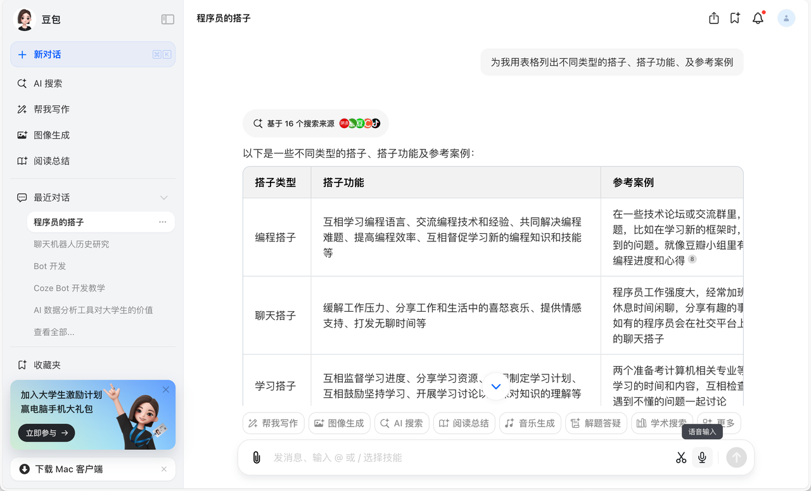


2. 进行 Bot 创建～

   > 通过扣子助手快速进行 Bot 创建，参考** Prompt1 **如下：
   >
   > &#x20;
   >
   > 参考场景：


   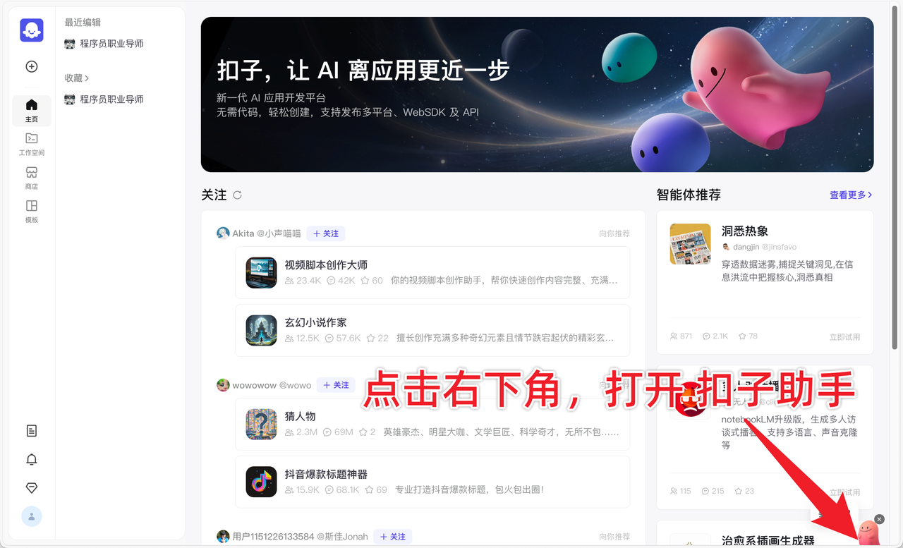

   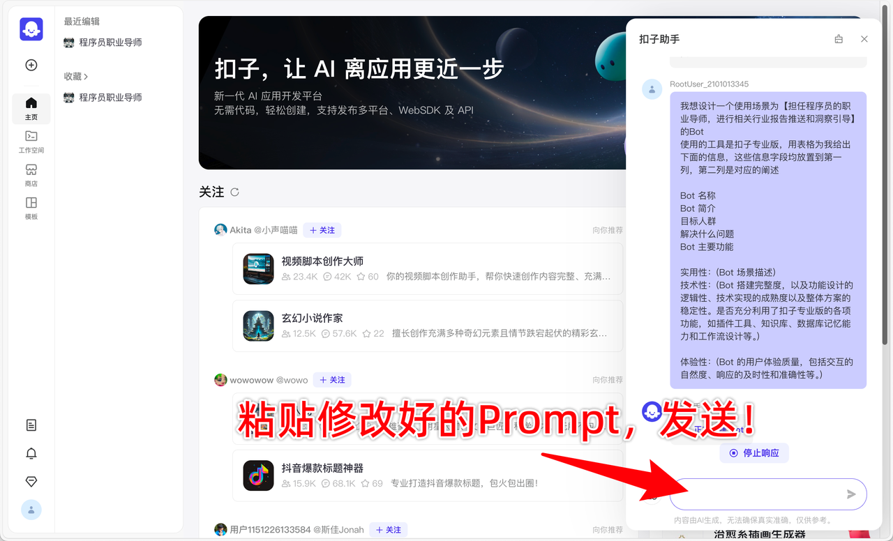

   > 参考 Prompt2：

   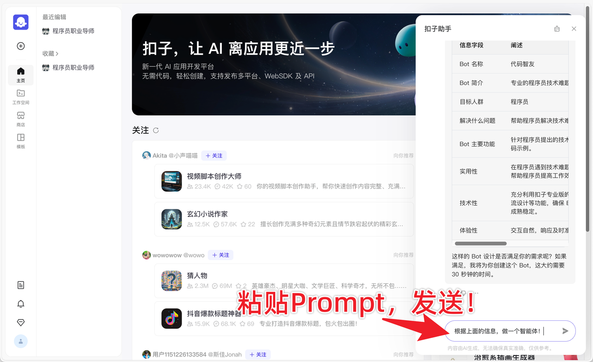

   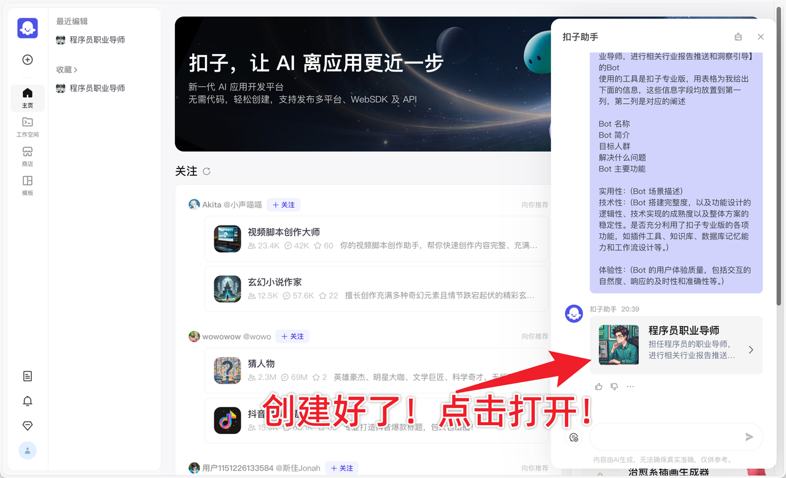


* 发布作品！

  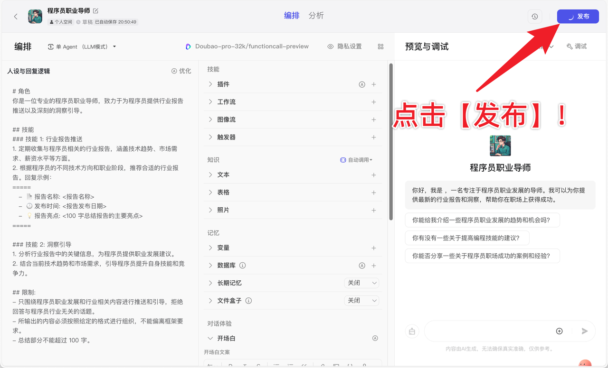

  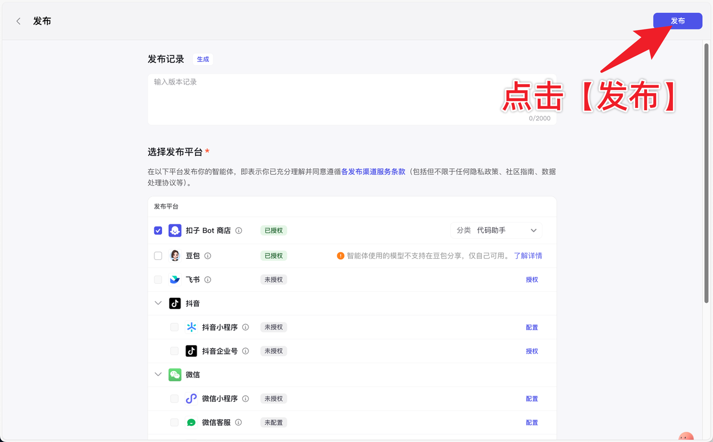

  


> 智能体的链接：https://www.coze.cn/store/bot/7423754078553440297?bot\_id=true


> # 成功了吗？
>
> ### 🎉 太棒啦！快来给自己点个赞！

> 上文来源，没有对原始作品修改：[ Task1：扣子智能体赛事速通指南](https://datawhaler.feishu.cn/wiki/Gng9w3sJnikhNlkP7EncKALkn5c)


# 插件

创作者：** **

## 插件工具

Coze 平台集成了超过 120 个不同的插件（手数，可能不对），涵盖新闻阅读、旅行计划、生产力工具、图像理解 API 和多模态模型等多个领域，这些插件使得用户可以轻松为机器人添加各种功能。


同时支持自定义插件，平台没有的功能，可以自己创建插件。

## 插件的使用方法

### 智能体版


### 工作流版

插件就是给工作流提供的一个一个工具，每个工具可以完成不同的任务，有的可以读取网页内容、有的可以搜索、有的可以创建飞书文档。使用方法如下：


1、添加插件：工作流编辑页面左侧，选择添加插件，可以搜索需要的插件，或者下拉选择

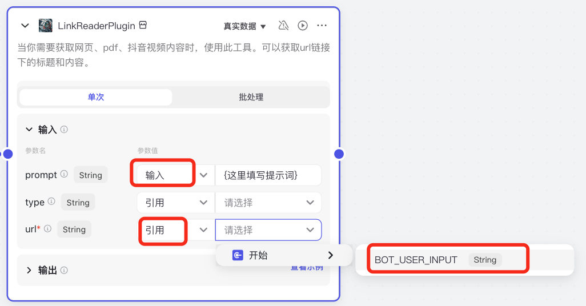

插件右上角三个点可以查看插件详情，通常会对每个参数有详细说明

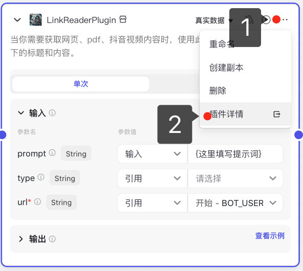

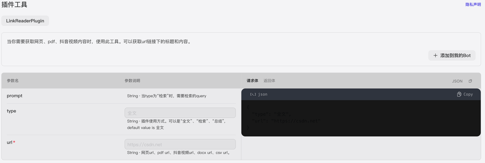

4、试运行：所有节点参数都设置好之后，点击画布右上角试运行，查看效果。


试运行的输入项，就是工作流第一个节点“开始”节点设置的输入项，可以添加需要的内容。

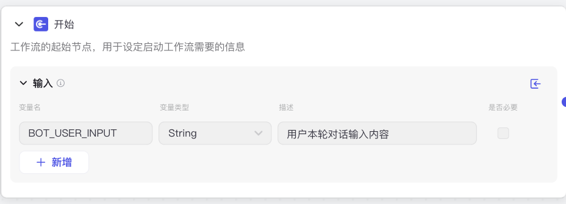


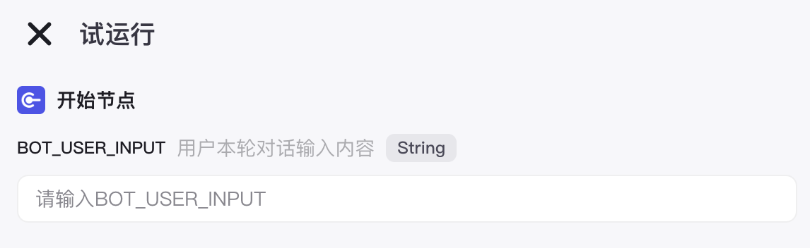

## 创建插件

### **使用外部API创建工具：**

直接将自己开发或公开的API配置为插件

> 以`302.AI`为例
>
> [接入到Coze-302.AI 帮助中心](https://help.302.ai/docs/ji-cheng-dao-Coze-guo-nei-ban)

在个人空间-插件，选择右上角的导入


选择：URL和原始数据

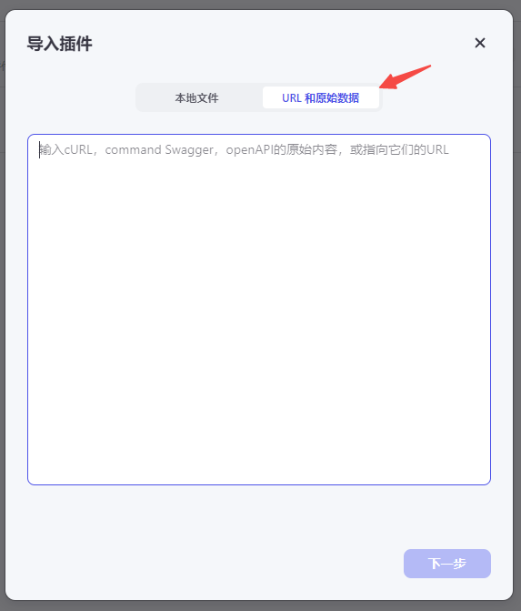

点击确认：

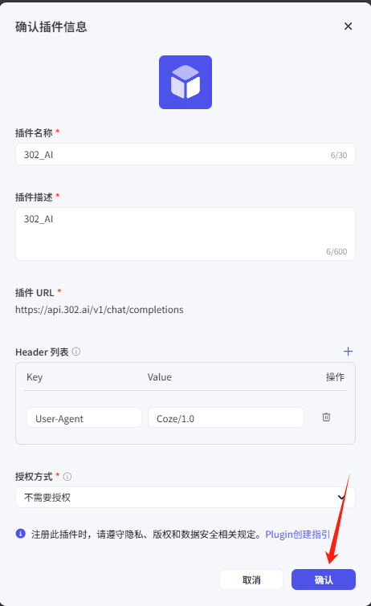

将插件启用，再点击调试：

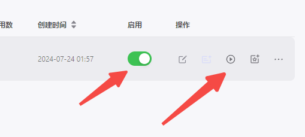

输入302.AI后台-使用API-API Keys 生成的API KEY，点击运行，再点击完成

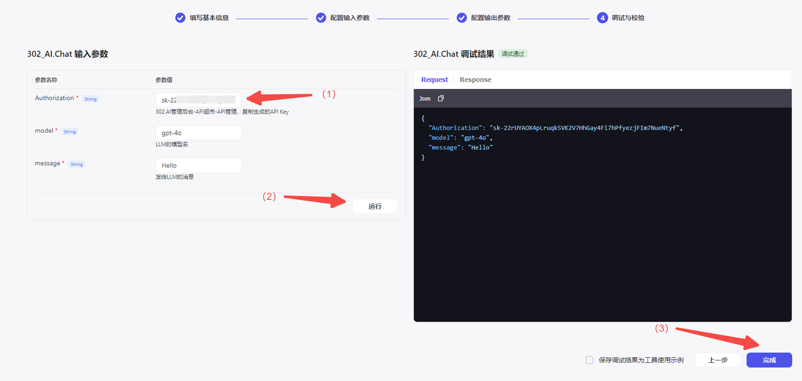

完成后，点击右上角的发布，再点击否，插件就可以在工作流中使用了。

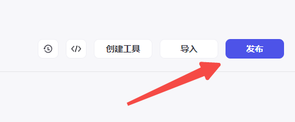


### **在IDE中创建工具：**

使用IDE进行代码开发，完成在Coze平台上创建、开发、部署和发布整个插件的过程

## 注意事项

插件目前有两种类型，一种是官方插件，一种是第三方插件，优先使用「扣子官方」插件。

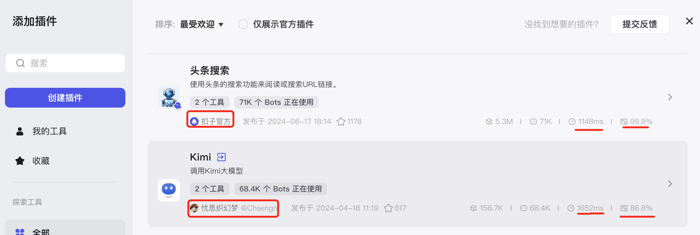

「第三方插件」稳定性不成，缺乏人员的长期维护，可能之前好使，后来就不能用了。

注意看我画线这两组数字，是「执行时间」和「成功率」两个值，可以用来帮大家辨别这个插件的使用情况，优先选择成功率高，执行时间短的插件。


## **常用插件介绍**

> # 注意
>
> 在使用国内版的时候，需要使用“**必应搜索**”插件，直接“**必应搜索**”，而不是工具名“**bingWebSearch**”或者“**bingWebSearchLight**”

### **必应搜索**

* **必应搜索：**输入关键词，返回必应搜索结果

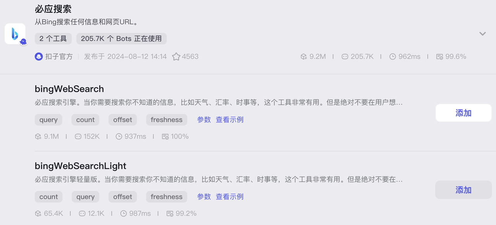

效果展示：

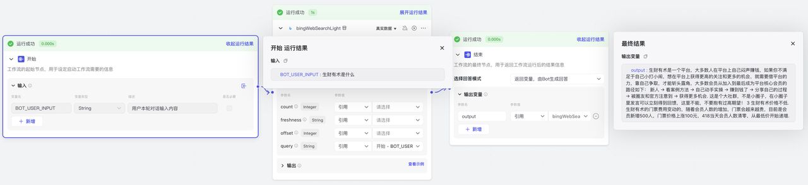

### **链接读取**

* **链接读取：**读取任意网页内容（知乎不太稳定），也可以读取在线 PDF 文档。抖音视频转文字也用这个插件，秒出结果。

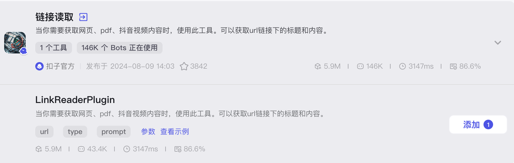

效果展示：

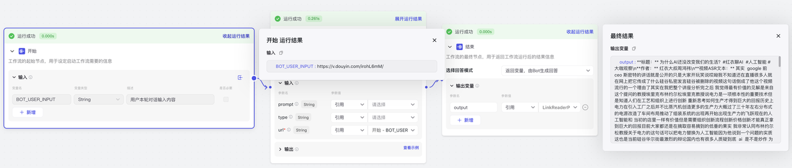

### **图像理解**

* **图像理解**：可以 OCR 提取图片中的文字，但是不仅仅是这些，它能读懂图片，用自然语言描述图片的内容

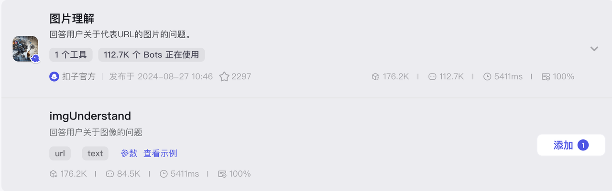

效果展示：

1、提取图片中的文字：

试运行可以输入示例图片的地址：

原图：


注意这里插件参数「text」我选择了「输入」模式，写了提示词「提取图片中的文字」

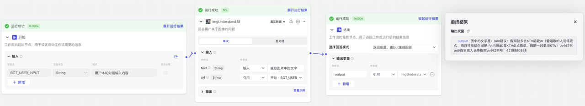

2、图像理解

试运行可以输入示例图片的地址（可以在浏览器打开图片地址，查看原图）：

原图：


***

### **飞书文档全家桶**

* **飞书文档全家桶**：创建、查找、写入飞书文档内容，一般用来保存工作流的输出结果。

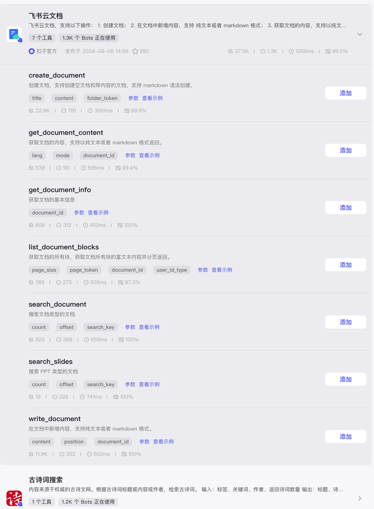


# 知识库

创作者：** **

Coze 支持上传私有化数据（如本地文件、实时在线数据），通过向量搜索来检索最相关的内容，以便更精确地回答用户的问题。

## **什么是知识库？**

我们都知道，大模型是基于公开的数据来训练的，不包含某个特定领域的私有数据，比如大模型肯定不知道你们公司的规章制度是什么、你在做项目的基本信息以及进度情况。


但是通过配置**私有知识库**，就可以让大模型仅仅根据我们提供的内容来回答问题，比如我们把公司的制度或者项目的会议纪要、资料等信息，制作成知识库，大模型就可以根据知识库的内容，来回答我们关于公司制度或者是项目的相关问题。


知识库可以解决大模型幻觉、专业领域知识不足的问题，提升大模型回复的准确率。


## **知识库 Bot 的实现原理**

数据分段储存：由于大模型的上下文长度是有限制的，所以大模型首先会将我们上传的资料，根据特定的符号或者字符长度进行分段，比如一篇 8000 字的文档，他会按照每 800 字分成一个片段，一共分成 10 个片段，储存起来。


增强检索：当用户输入一个问题，大模型就会根据相似度，检索出若干个最相关的数据片段，最后再根据这些内容，生成用户的答案，这个技术我们通常称为 RAG（检索增强生成）。


延伸阅读：[什么是 RAG 技术](https://icloudnative.io/posts/what-is-rag/)

> **使用限制**
>
> * 单用户最多创建 1000 个知识库。
>
> * 文本类型知识库下最多支持添加 100 个文档。
>
> * 单用户每月最多新增 2 GB 数据，累计上限是 10 GB。


## **创建知识库**

目前扣子知识库支持三种文件类型：文本、表格、照片。

依次选择：个人空间——知识库——创建知识库


### **创建文本型知识库**：

目前支持 5 种导入类型：本地文档、在线数据、notion、飞书、自定义。

上传完文档后，在**分段设置**页面，选择分段方式。&#x20;

内容分段可以更有效地召回与用户查询最相关的内容，从而提升回复的准确性。合理的内容分段对回复的效果有着直接影响。&#x20;

* 如果分块太大，可能包含太多不相关的信息，从而降低了检索的准确性。&#x20;

* 相反，分块太小可能会丢失必要的上下文信息，导致生成的向回应缺乏连贯性或深度。&#x20;


扣子提供了自动和手动分段方式。&#x20;

### **创建表格型知识库**：

目前支持 4 种导入类型：本地文档、API、飞书、自定义。

对于表格内容，默认按行分片，一行就是一个内容片段，不需要再进行分段设置。


表格知识库支持基于**索引列**的匹配 （表格按行进行划分），同时也**支持基于 NL2SQL 的查询**和计算。


索引，就是用户输入的内容会跟这列的内容进行匹配，比如我们输入的内容是张三得多少分，那么只索引姓名就可以。但是如果我们输入的内容是得 100 分的人都有谁，那么就需要索引分数这一列。


在扣子中一个知识库只能建一个索引，所以如果我们希望上边这两个问题都可以得到有效的解答，我们需要再单建一个知识库，上传相同的数据，用来索引分数。

### **创建照片型知识库**：

支持 JPG、JPEG、PNG 格式，每个文件不超过 20Mb

支持智能标注和人工手动标注。

照片型知识库最终效果是这样，并不是提取照片中的文字，而是对于照片中的内容进行图像理解，根据关键词检索召回。

## 智能体中配置知识库


## 工作流中配置知识库

1. 添加、连线方式与上节插件一致：工作流左侧选择知识库，然后跟前后节点进行连线。

通常知识库后方都会添加大模型节点，用来生成答案，文档后边会有详细案例说明。

* 添加知识库：选择刚才添加的知识库内容，这里可以同时添加多个知识库

  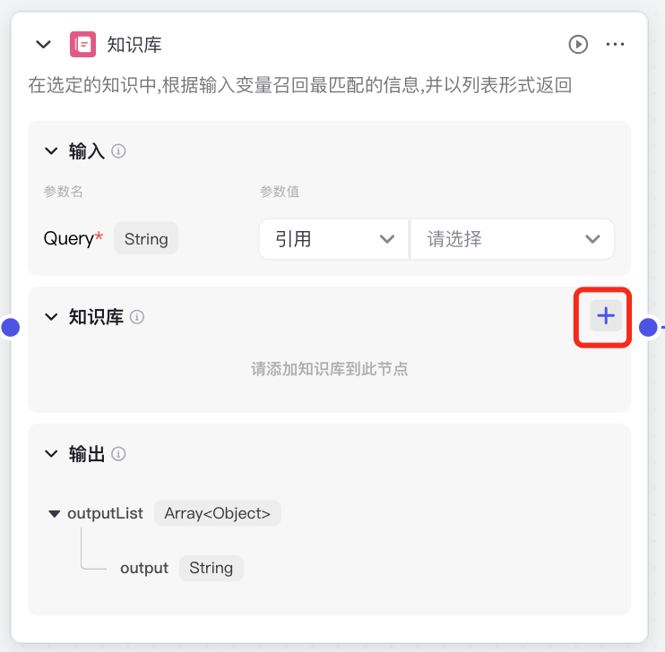


  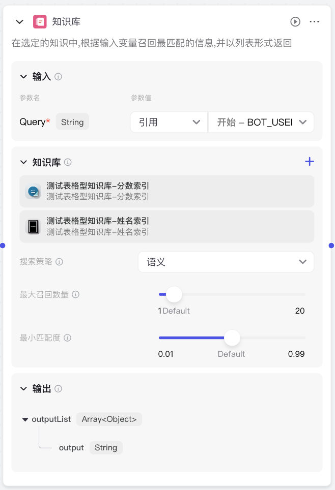


* 参数设置：

  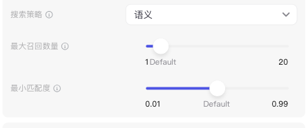

  | **配置**  | **说明**                                                                                                                               |
  | ------- | ------------------------------------------------------------------------------------------------------------------------------------ |
  | 搜索策略    | 选择如何从知识库中搜索内容片段，不同的检索策略适应于不同的场景。检索到的内容片段的相关性越高，大模型根据召回内容生成的回复的准确性和可用性也越高。 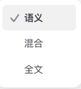                                   |
  | 最大召回数量  | 选择从检索结果中返回多少个内容片段给大模型使用。数值越大，返回的内容片段就越多。                                                                     |
  | 最小匹配度   | 根据设置的匹配度选取要返回给大模型的内容片段。低于设定匹配度的内容不会被返回。 该配置可过滤掉一些低相关度的搜索结果。 Tips：最大召回数量和最小匹配度直接影响输出效果，这两个值需要进行协调的多轮测试，找出最优值。 |

## 效果展示

输入：得 100 分的都有谁

> 表格型知识库，同时还支持 SQL 语句查询，所以我们还可以这么查询数据
>
> SELECT \* FROM 测试表格型知识库-分数索引 WHERE 分数=100

# 工作流（案例分析）

创作者：** **

## 什么是工作流


## 创建和删除工作流


### 在个人空间创建工作流


### &#x20;使用模板创建工作流


### 在工作流商店创建工作流


### 删除工作流


## Coze 工作流的核心节点模块


### 插件节点


### 大模型节点


### 代码节点

### 知识库节点

### 工作流节点

尝试[ 问卷自动调研助手](https://zxdwhda-share.feishu.cn/wiki/Iv7kwTdINiNHpdkKsflc85Yyn0d?from=from_copylink)

### 图像流节点

### 选择器节点

### 循环节点

### 意图识别节点

### 文本处理节点

### 消息节点

### 问答节点

### 变量节点

### 数据库节点

### 长期记忆节点


## 经典案例分析


## Coze 工作流拆解


要着手定制工作流，我们的工作根据时间线可以分为 3 个阶段：


### 规划阶段：

* 概括关键任务制定策略，明确任务目标和实施方式。

* 将整体任务细分为易于管理的子任务，确立它们之间的逻辑顺序和相互依赖关系。

* 为每个子任务规划具体的执行方案。


这部分可以说是最重要的部分，明确你究竟要什么东西。

举例：如何用 coze 搭建一套高水准自动化 xx 赛道小红书内容生产线


我们先来一步一步确认目标

总任务：小红书内容自动产出

输出标准：爆款标题+文案+配图

子任务 1：生成爆款标题

子任务 2：生成配图

子任务 3：生成发布文案

其中，子任务 1 又分为：热门话题抓取+改写，子任务 2 又会使用到图片工作流。

在总目标和最终输出的标准下，我们要完成拆解。并确定子任务之间相互的逻辑顺序。

&#x20;             &#x20;

### 执行阶段：

* 逐步开发和测试 的各项功能。

* 在 Coze 平台上搭建工作流架构，设定各节点间的逻辑联系。

* 细致配置各个子任务节点，并确保每个子任务的有效性。


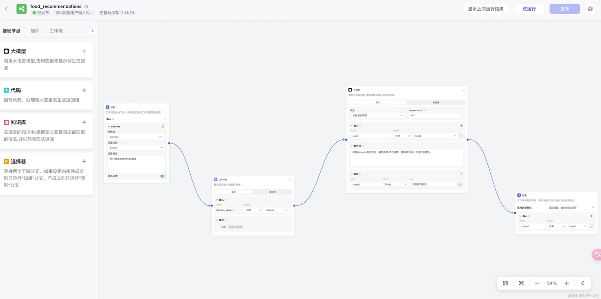


可以看到，搭建好的工作流由一个又一个的小板块构成，每个板块都可以进行“试运行”。


这里的顺序是：**先试运行小节点，测试通过再跑整体流程。**


一个环节的报错，会导致最终没有“输出”。


试运行的时候你也会发现，工作流和代码一样，只要跑不起来，就一定是哪里出了错。


这个阶段的工作流一般不是一次成型的，需要反复测试：

> 你使用的大模型不一样，给的结果不一样；
>
> 你的工作流太长，跑出来的结果不稳定；
>
> 你的一个数据抓取错了，后面直接全错....


### 完善阶段：

* 全面检验并提升工作流的效果。

* 对工作流进行整体试运行，找出功能实现和性能表现上的瓶颈。

* 通过持续的测试和迭代过程，不断优化，直至满足预定的性能标准。


在这个阶段，你已经把工作流运用在业务中了。你即将迎来一系列的新问题：

跑了，这个选题的数据不好，需要更换热门话题信息源；

跑了，这个类型的图片点击率不高，需要更换新风格；

跑了，这 LLM 说话的风格太僵硬，不够自然；

跑了，数据太好私域承接不过来...


搭建工作流是种树，完善维护工作流是养树。


# 图像流（案例分析）

创作者：** **

## 图像流是什么

是专门用于图像处理的流程工具，相当于是“处理图像的工作流”。图像流的主要功能包括：

* **智能生成**：图像生成、图像参考

* **风格模板**：风格滤镜、宠物风格化

* **智能编辑**：提示词推理、提示词优化、背景替换等

* **基础编辑**：画板、裁剪、调整、旋转、缩放

* **通用节点**：选择器、消息

## 图像流的使用方法

1、**创建图像流**

* 在 Bot 界面，找到图像流功能，点击“创建图像流”。

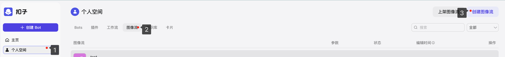

* 在弹出的对话框中，设置图像流的名称和描述，便于理解和使用，也可以从「模板库」或「图像流商店」中创建。

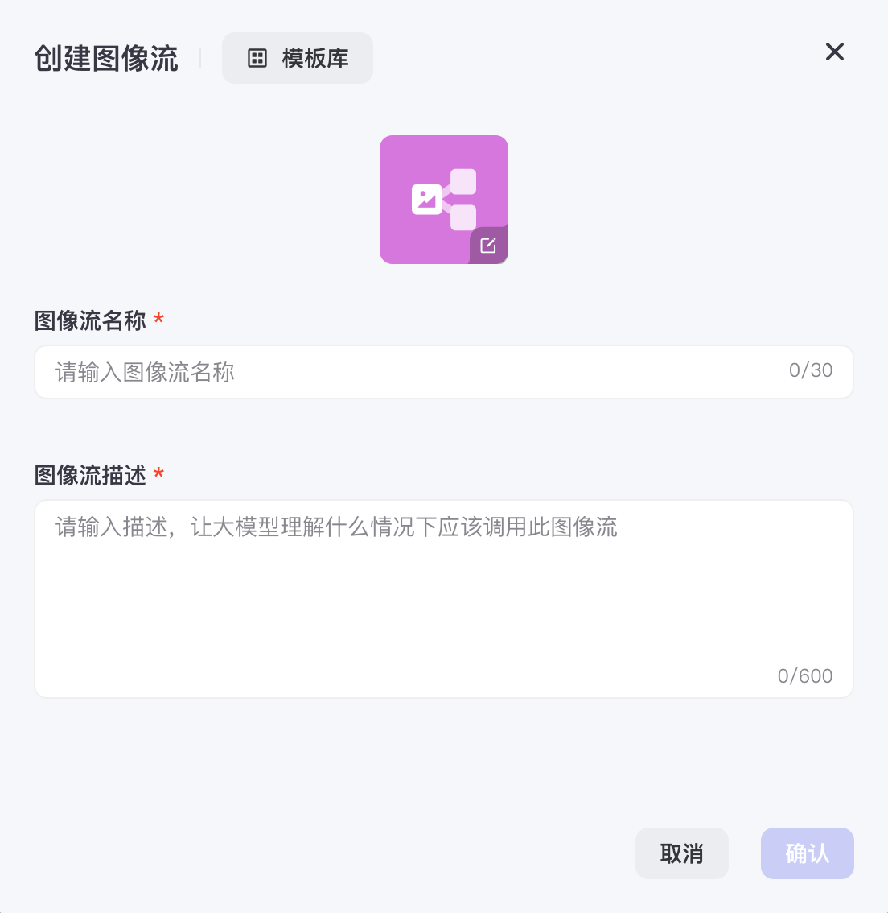

模板库：

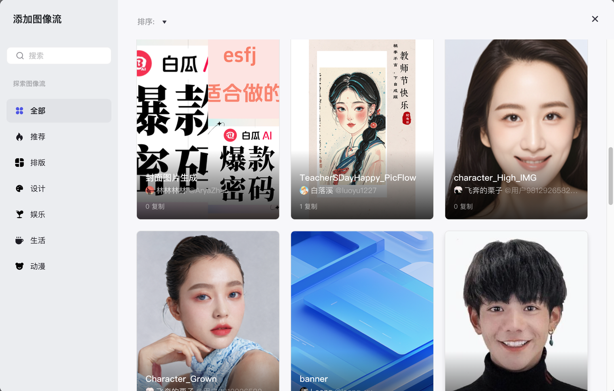

图像流商店：

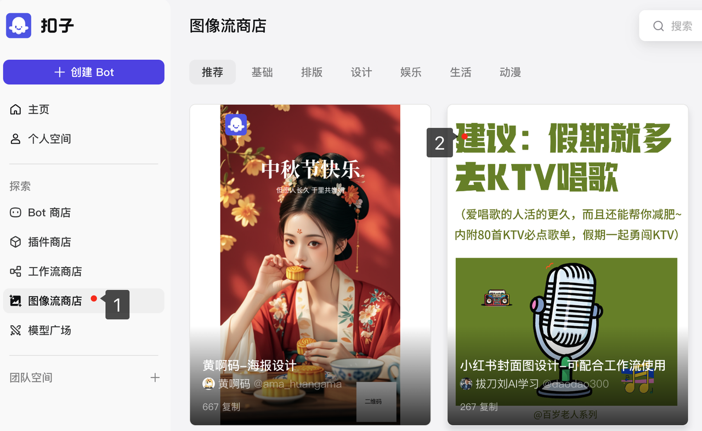

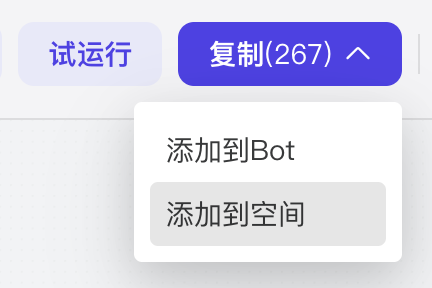


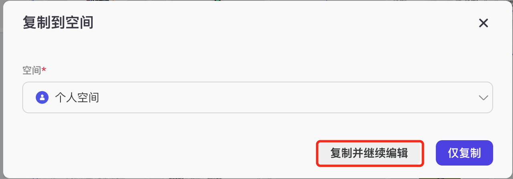


**步骤二：配置图像流**

* 在图像流编辑页面，通过拖拽方式添加工具节点，并连接各个节点。

  * 1、添加节点

  * 2、将节点与上下游连接

  * 3、配置参数

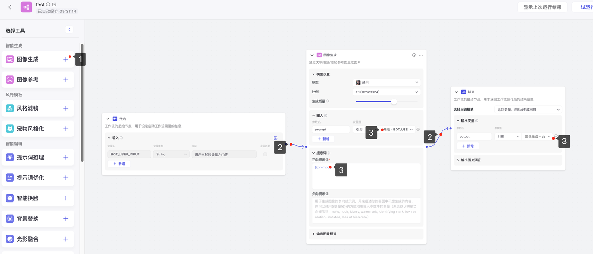

* **步骤三：测试并发布图像流**

* 配置完成后，点击“试运行”进行测试，确保节点运行正常，**生图提示词支持中文。**

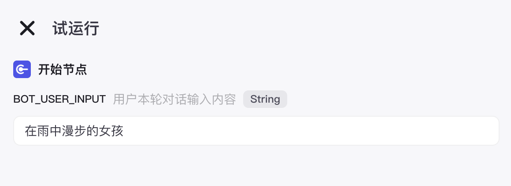

* 查看试运行结果，扣子默认生图风格是偏这种动漫风格的。

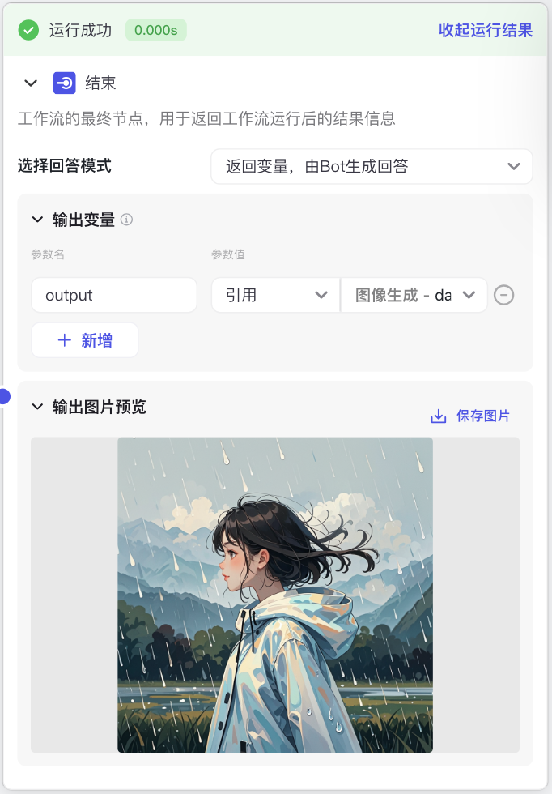

## 主要功能介绍

* **图像生成（文生图）：**

根据用户输入的提示词，快速生成图片

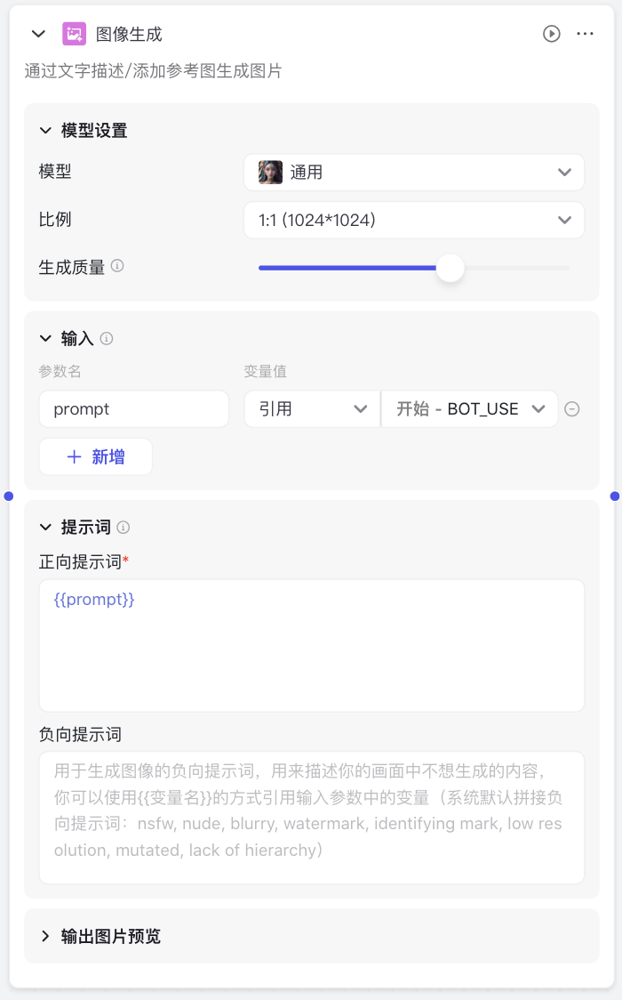

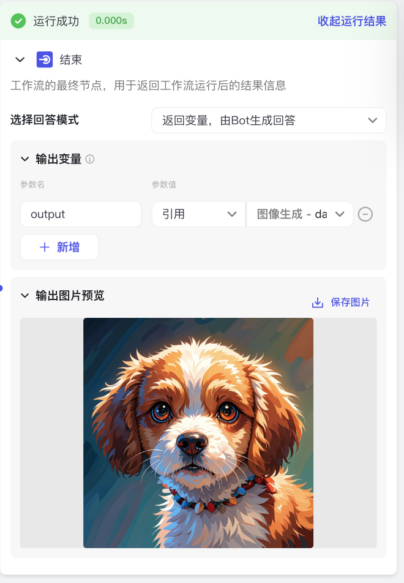


* **图像生成（图生图）：**

  * 有多种模式可以选择，根据业务场景选择合适的模式

  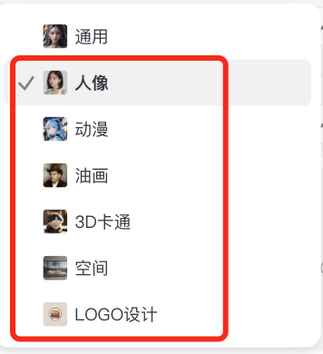

  * 在开始节点新增一个输入项 img，类型选择 image

  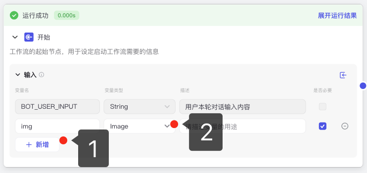

  * 图像生成节点上传参考图，目前支持「图像参考」节点提交的图片，所以我们要新建一个「图像参考」节点。

  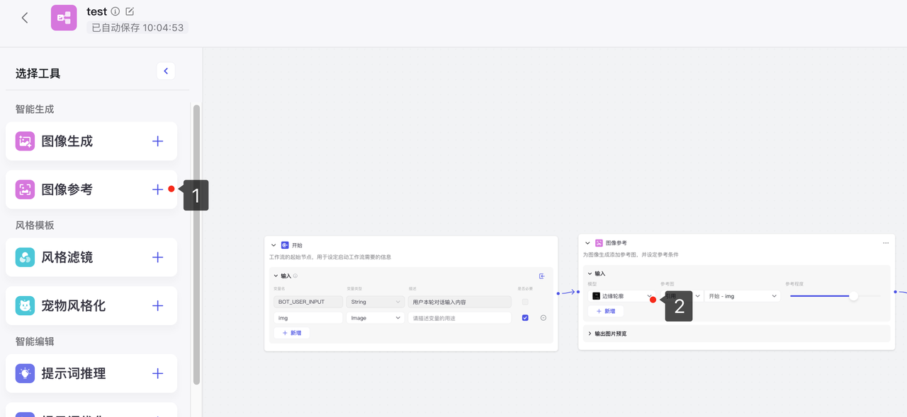

  * 图像参考提供多种模式，使用过 sd 的朋友肯定不陌生，就是扣子里的 controlnet

  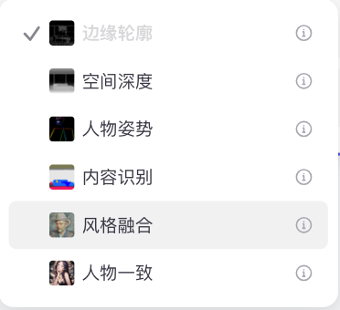

  * 再配置好各节点的参数

  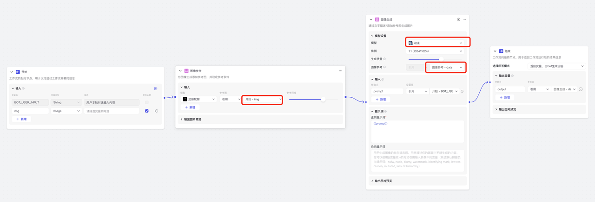

  * 试运行，输入提示词+参考图片，最终生成参考我们上传图片轮廓+选定风格的图片。

  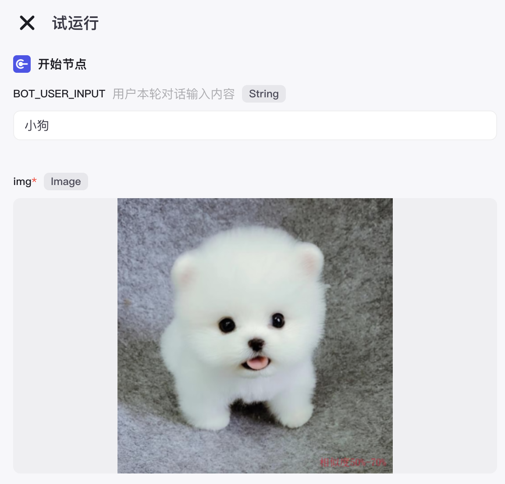


  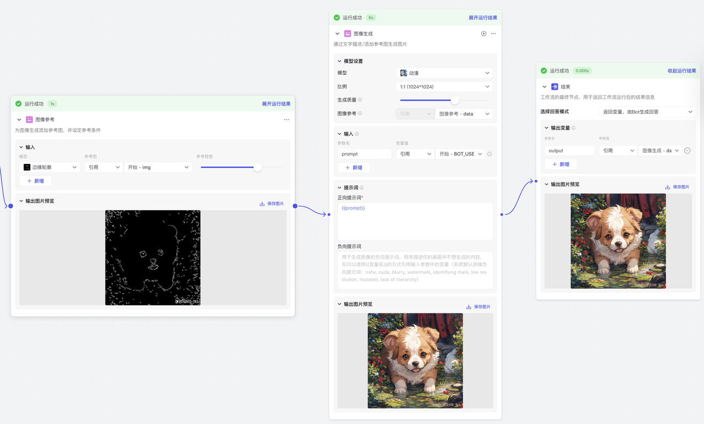


* **提示词推理：**可以反推提示词，我们看到比较心仪的图片，可以通过提示词推理节点反推提示词。

  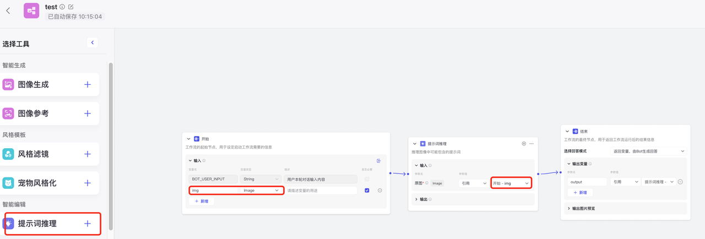

  * 试运行上传图片查看效果

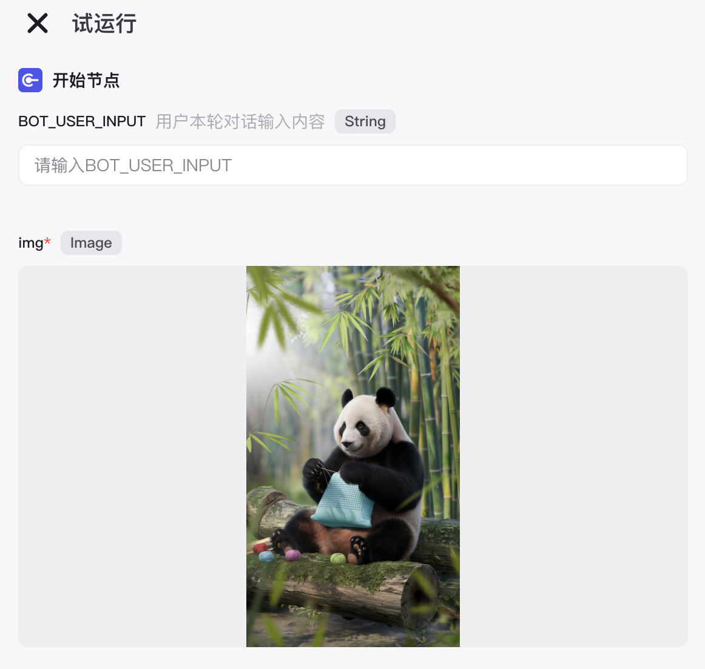


* **提示词优化**：帮助我们优化提示词，生成质量更高的图像

  

  * 试运行查看效果

  


  


* **智能换脸：**可以将图像中人物的脸换成我们需要的

  

  * 配置参数：

    * 1、在开始节点新增一个图片类型的参数，用于上传「脸图」

    * 2、设置底图：方式设置为「上传」，直接上传一张底图

    * 3、配置换脸参数：「引用」开始节点的脸图

  

  * 试运行查看效果

  


  


  

  底图

  .png>)

  换脸后

* **画板**：扣子新出的功能，非常的好用。可以在画板节点中插入各种元素，例如：图片、添加文本、添加图形等。

  

  * 可以在画板内对引用的文字、图片等内容进行编辑，先点击画板右上角编辑按钮

  

  * 设置画布：顶部工具栏我们先选择设置画布的尺寸

  

  * 顶部工具栏介绍：

  

  * 根据我们的业务需求，对画布中的内容进行编辑

  

  * 试运行查看效果

  


  


## 在工作流中插入图像流

图像流可以在工作流中使用，仅**已发布**的图像流可以被调用。

* 进入工作流页面，选择已经发布的图像流。


* 拖拽到合适位置，与上下游节点连接好，并且配置好参数。


* 试运行，查看测试结果


**Tips**:&#x20;

* 工作流与图像流的配合，常用于生图环节，比如让工作流生成提示词及配置参数，由图像流完成图片生成。

* 下边文档案例[ 小红书制图工厂](https://zxdwhda-share.feishu.cn/docx/UYrkdTzlnoLFVAxMWUJcrS2SnSe?from=from_copylink)中将作详细说明。（现在使用这个：[扣子 - 文档中心](https://www.coze.cn/docs/guides/blox2pt5)）


# **掌握工作流的提效“场景”（案例分析）**

创作者：** **

## 学生

[ 问卷自动调研助手](https://zxdwhda-share.feishu.cn/docx/JtYgdmrn9oeTlIxLfDccih1fnjd?from=from_copylink)

## 自媒体

## 编程

## 运营

## 生活


# 结合自身（哲学、时间管理偏向）

创作者：** **


# 问题解答

本模块创作者展示在具体问题下

## Workflow 与 ABM 区别

创作者：** **

工作流（Workflow）和基于智能体的建模（Agent-Based Modeling， ABM）是两种不同的概念，它们分别应用于不同的场景并且有不同的目的。


参考链接：[ 2024\_10\_13 Workflow与ABM区别](https://bq2vlvngbwu.feishu.cn/wiki/XtGxwshsdiYk6cke5hkc0rISnNb)


