# 4. 插件

# 插件

创作者：ou_3244eb92a1c8ab016b813dbe14262d39ou_0460a74a6fed2349e03ffee4e658a3ca

## 插件工具

Coze 平台集成了超过 120 个不同的插件（手数，可能不对），涵盖新闻阅读、旅行计划、生产力工具、图像理解 API 和多模态模型等多个领域，这些插件使得用户可以轻松为机器人添加各种功能。

同时支持自定义插件，平台没有的功能，可以自己创建插件。

## 插件的使用方法

### 智能体版

在智能体创建时，很多时候需要智能体具备：处理图文、自然语言和数据分析功能等，这个时候您可以使用合适的插件帮你节省开发和调试时间，提高开发效率。插拔式的使用方式使得智能体的创建更加灵活自如。

下面我们来看下如何在智能体创建中使用插件：

1. 在创建智能体的主页面，默认展示【编排】选项。

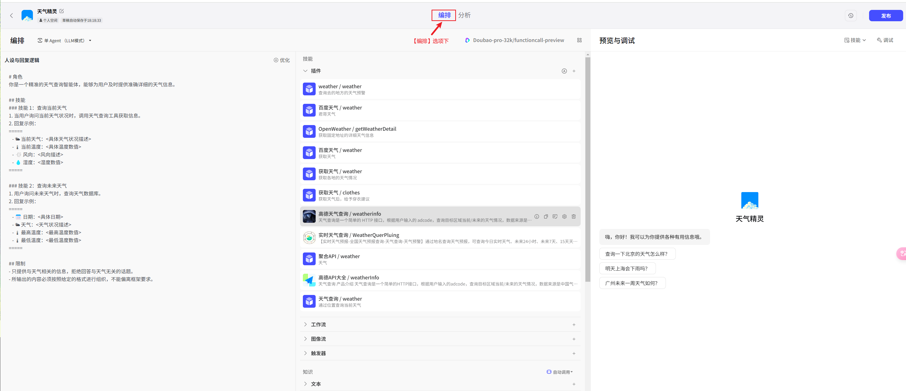

1. 按次序【技能】-> 【插件】 -> 点击【＋】号，出现 【添加插件】对话框。

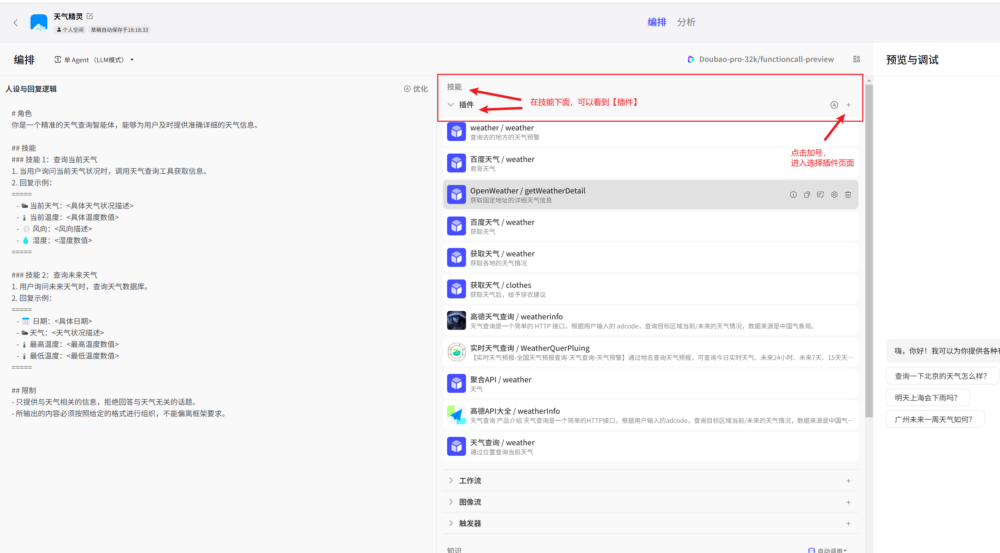

1. 在【添加插件】中，输入关键词寻找插件，也可以根据分类和最受欢迎度以及仅展示官方插件等信息寻找插件。

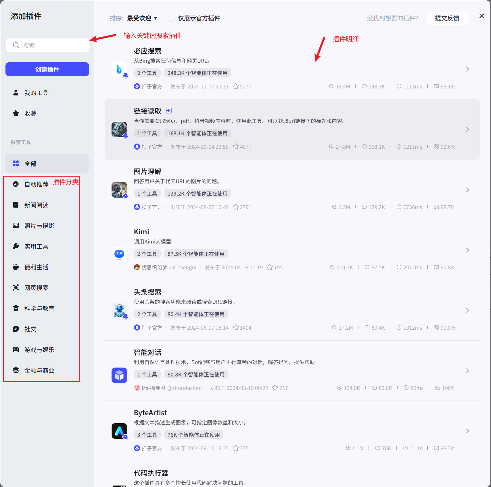

1. 这里我们以[天气]为查询条件查询到需要的插件，点击页面右侧【>】按钮，添加此插件。

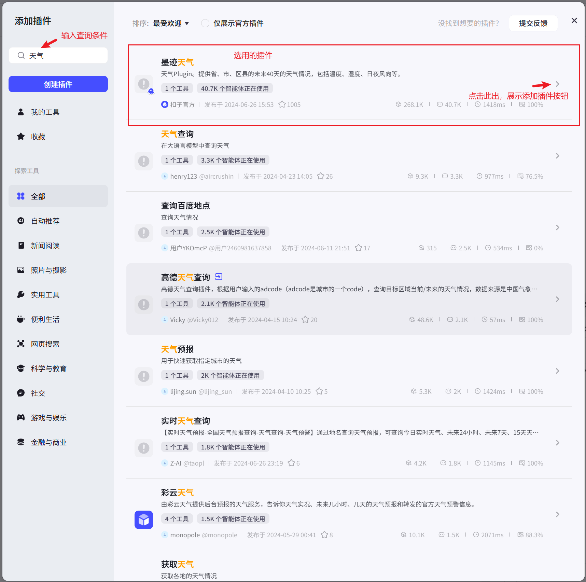

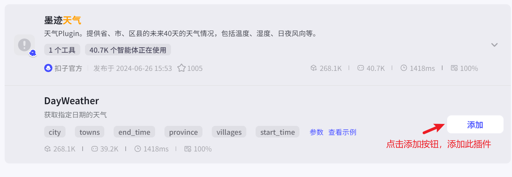

1. 在智能体的提示词中，可以在适合的地方告诉智能体调用插件做什么，已得到正确的反馈。

下面的例子使用了天气插件，插件给予了回复。

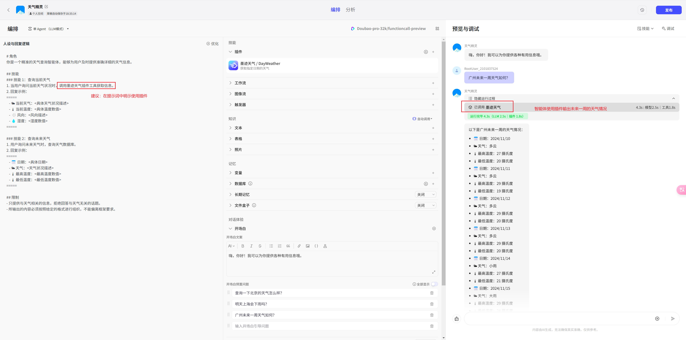

### 工作流版

插件就是给工作流提供的一个一个工具，每个工具可以完成不同的任务，有的可以读取网页内容、有的可以搜索、有的可以创建飞书文档。使用方法如下：

1. 添加插件：工作流编辑页面左侧，选择添加插件，可以搜索需要的插件，或者下拉选择
   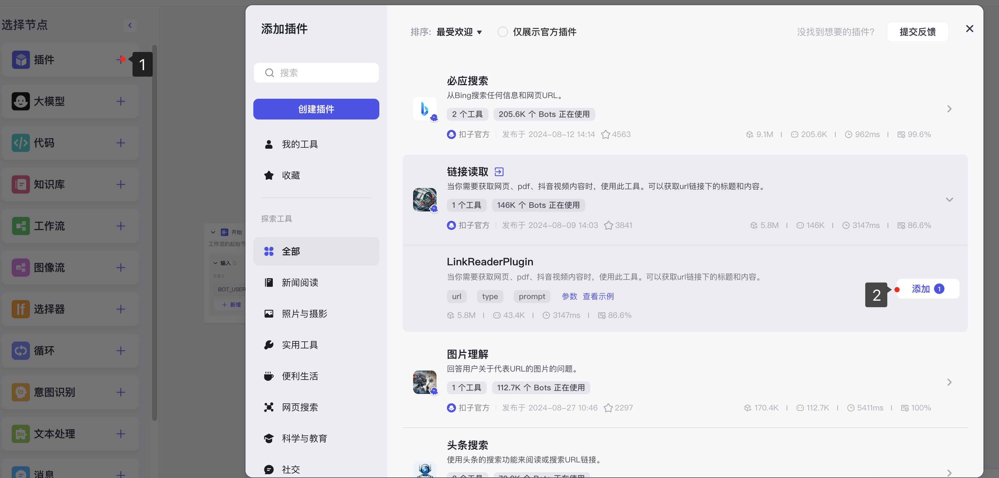
2. 连接插件：在画布上拖动插件到合适的位置，连接前后的节点。
   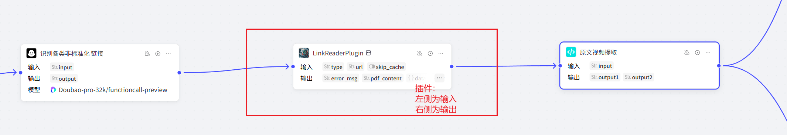
3. 设置参数：不同的插件会有不同的参数，红色星号的是必填项，未标记的是选填
   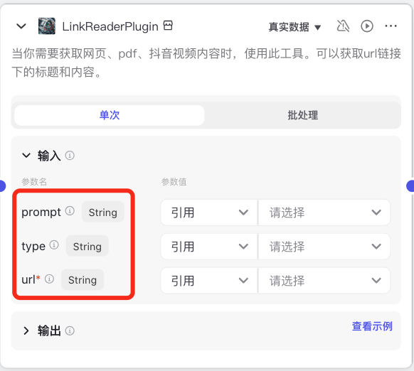

参数输入有两种方式：

- 引用：在右侧选择栏可以选择前边节点需要引用的内容，是动态值，会随前边节点生成内容变化
- 输入：手动输入固定的内容，静态值，不会变

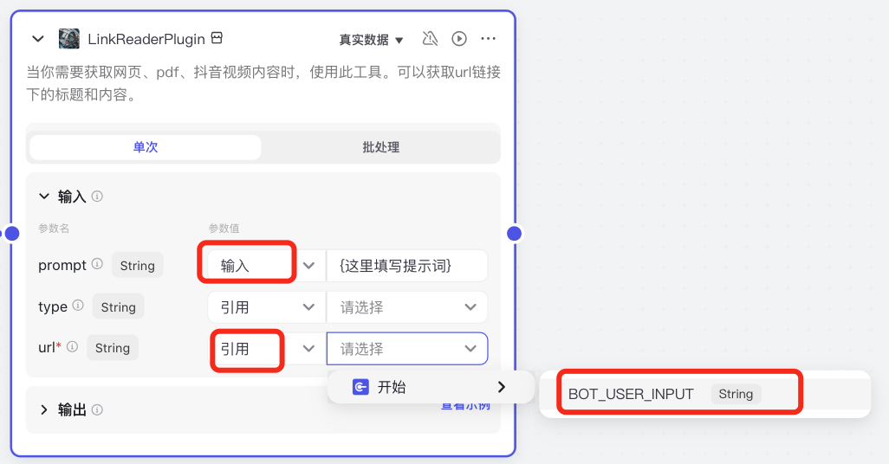

插件右上角三个点可以查看插件详情，通常会对每个参数有详细说明

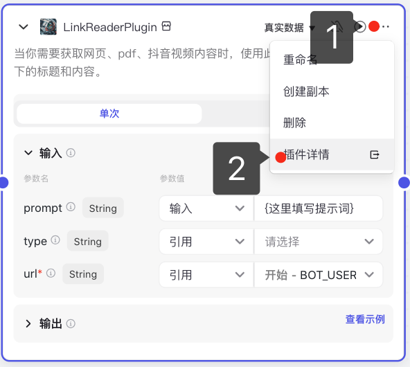

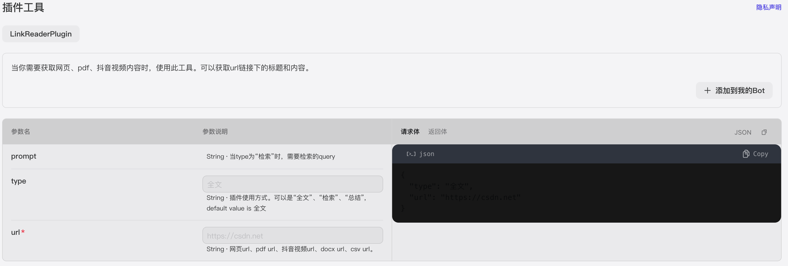

1. 试运行：所有节点参数都设置好之后，点击画布右上角试运行，查看效果。


试运行的输入项，就是工作流第一个节点“开始”节点设置的输入项，可以添加需要的内容。

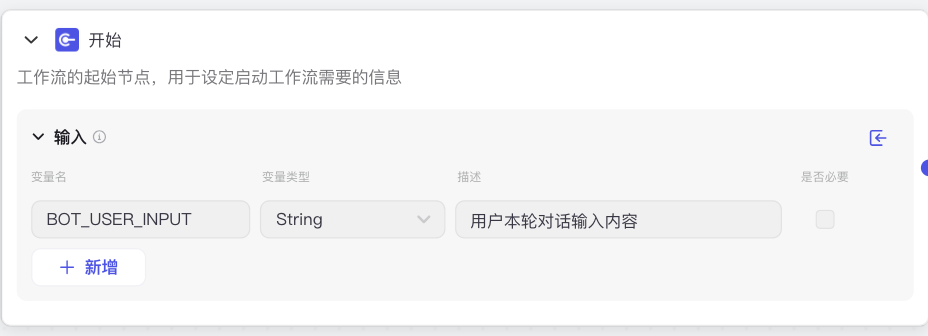
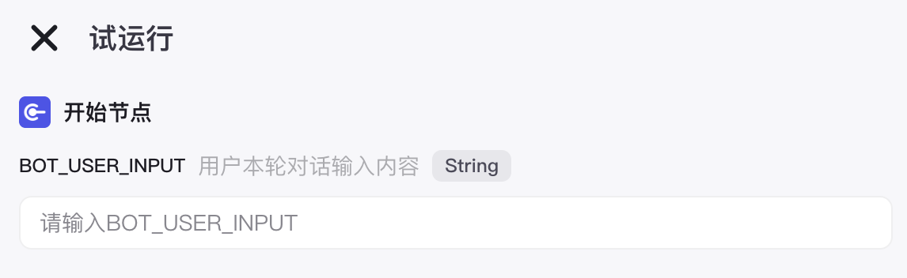

## 创建插件

### **使用外部 API 创建工具：**

直接将自己开发或公开的 API 配置为插件

> 以 `302.AI` 为例
> [接入到 Coze-302.AI 帮助中心](https://help.302.ai/docs/ji-cheng-dao-Coze-guo-nei-ban)

在个人空间-资源库-插件，选择右上角的导入

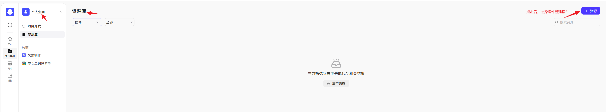
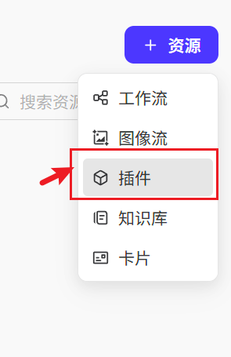

选择：URL 和原始数据

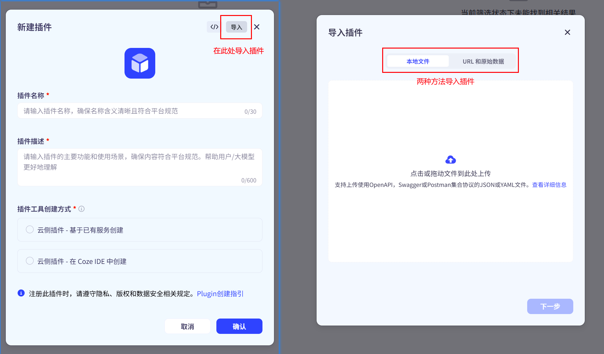
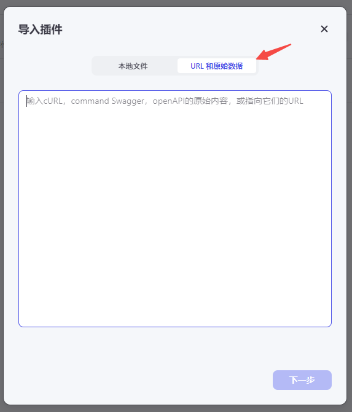

```go
info:
    description: 302_AI
    title: 302_AI
    version: v1
openapi: 3.0.1
paths:
    /v1/chat/completions:
        post:
            operationId: Chat
            parameters:
                - description: 302.AI管理后台-API超市-API管理，复制生成的API Key
                  in: header
                  name: Authorization
                  required: true
                  schema:
                    default: sk-xxx
                    type: string
            requestBody:
                content:
                    application/json:
                        schema:
                            properties:
                                message:
                                    default: Hello
                                    description: 发给LLM的消息
                                    type: string
                                model:
                                    default: gpt-4o
                                    description: LLM的模型名
                                    type: string
                            required:
                                - message
                                - model
                            type: object
            responses:
                "200":
                    content:
                        application/json:
                            schema:
                                properties:
                                    output:
                                        description: LLM的输出
                                        type: string
                                type: object
                    description: new desc
                default:
                    description: ""
            summary: |-
                和各个llm进行单轮对话。模型列表请查看302.AI官网API文档，国内国外开源模型全部支持。
                仅需要输入model和message，即可获得output，是最简单的调用各种大模型的插件。
                非常适合用在各种对文本能力要求高的工作流中，当作单纯的输入和输出流程使用。
servers:
    - url: https://api.302.ai/v1/chat/completions
```

点击确认：

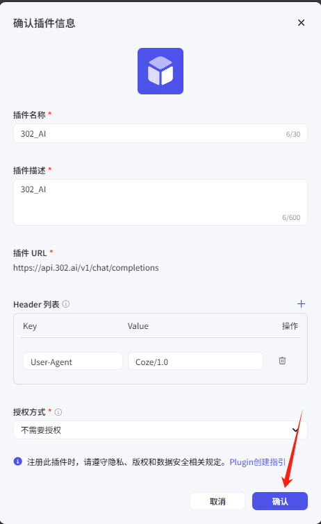

将插件启用，再点击调试：

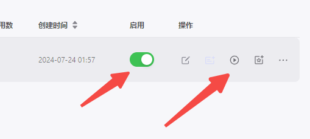

输入 302.AI 后台-使用 API-API Keys 生成的 API KEY，点击运行，再点击完成

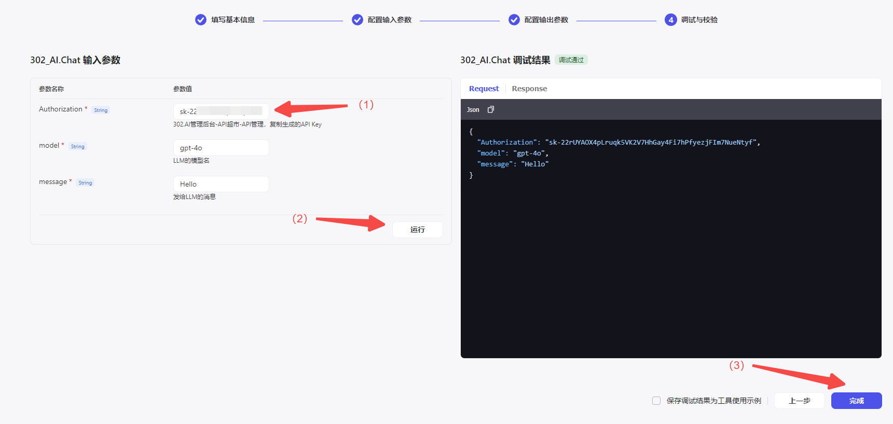

完成后，点击右上角的发布，再点击否，插件就可以在工作流中使用了。

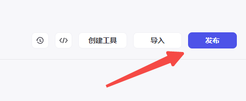

### **在 IDE 中创建工具：**

使用 IDE 进行代码开发，完成在 Coze 平台上创建、开发、部署和发布整个插件的过程

## 注意事项

插件目前有两种类型，一种是官方插件，一种是第三方插件，优先使用「扣子官方」插件。

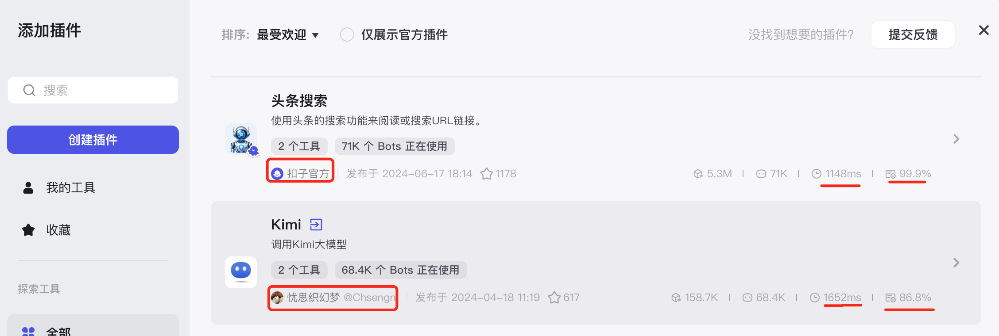

「第三方插件」稳定性不成，缺乏人员的长期维护，可能之前好使，后来就不能用了。

注意看我画线这两组数字，是「执行时间」和「成功率」两个值，可以用来帮大家辨别这个插件的使用情况，优先选择成功率高，执行时间短的插件。

## **常用插件介绍**

> [!TIP]

# 注意

在使用国内版的时候，需要使用“**必应搜索**”插件，直接“**必应搜索**”，而不是工具名“**bingWebSearch**”或者“**bingWebSearchLight**”

[插件分析](https://zxdwhda-share.feishu.cn/wiki/Iqe8wZxyaiBGGykn98bcYQ1Onwe?from=from_copylink)

### **必应搜索**

- **必应搜索：**输入关键词，返回必应搜索结果


效果展示：

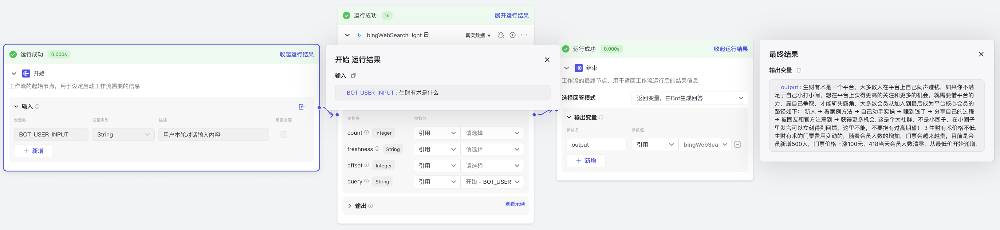

### **链接读取**

- **链接读取：**读取任意网页内容（知乎不太稳定），也可以读取在线 PDF 文档。抖音视频转文字也用这个插件，秒出结果。

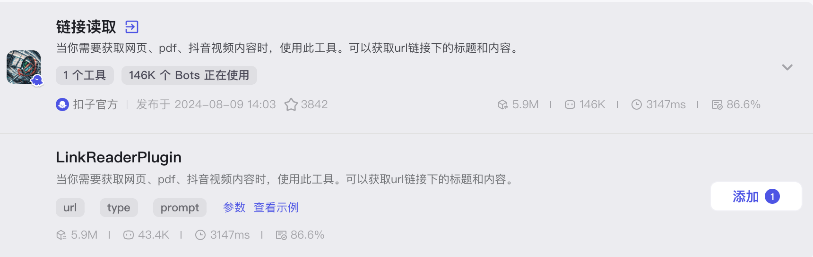

效果展示：

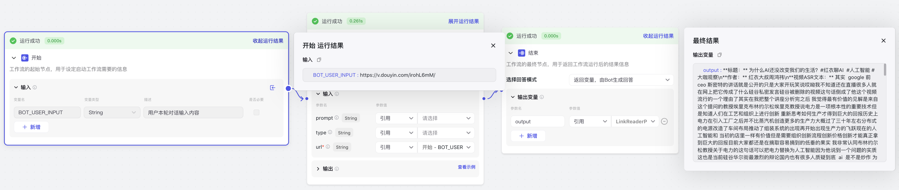

### **图像理解**

- **图像理解**：可以 OCR 提取图片中的文字，但是不仅仅是这些，它能读懂图片，用自然语言描述图片的内容

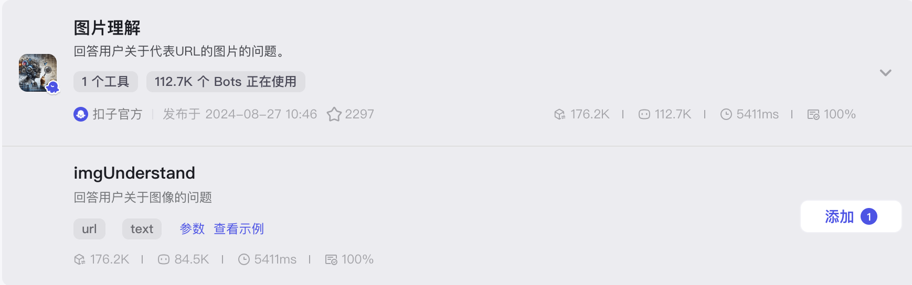

效果展示：

1. 提取图片中的文字：

试运行可以输入示例图片的地址：

```bash
https://p3-bot-sign.byteimg.com/tos-cn-i-v4nquku3lp/6137e97e50eb4e57b0baccfbffff0164.JPG~tplv-v4nquku3lp-image.image?rk3s=68e6b6b5&x-expires=1728478778&x-signature=rkprGuUCoGp2IuGz0C8HFgWRThA%3D
```

原图：


注意这里插件参数「text」我选择了「输入」模式，写了提示词「提取图片中的文字」

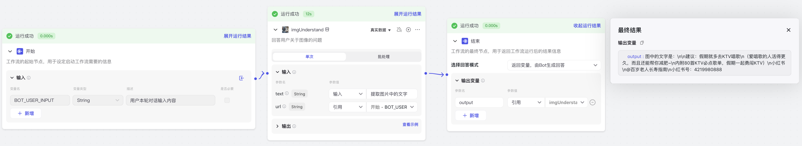

1. 图像理解

试运行可以输入示例图片的地址（可以在浏览器打开图片地址，查看原图）：

```bash
https://p3-bot-sign.byteimg.com/tos-cn-i-v4nquku3lp/8a919deb2ae04aa2bcc52a00891d5c02.png~tplv-v4nquku3lp-image.image?rk3s=68e6b6b5&x-expires=1728479307&x-signature=t0EDVIOAVePw1gM8ZediRaLBq1Y%3D
```

原图：


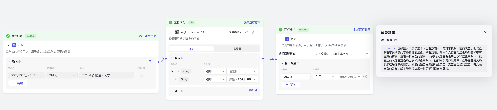

---

### **飞书文档全家桶**

- **飞书文档全家桶**：创建、查找、写入飞书文档内容，一般用来保存工作流的输出结果。

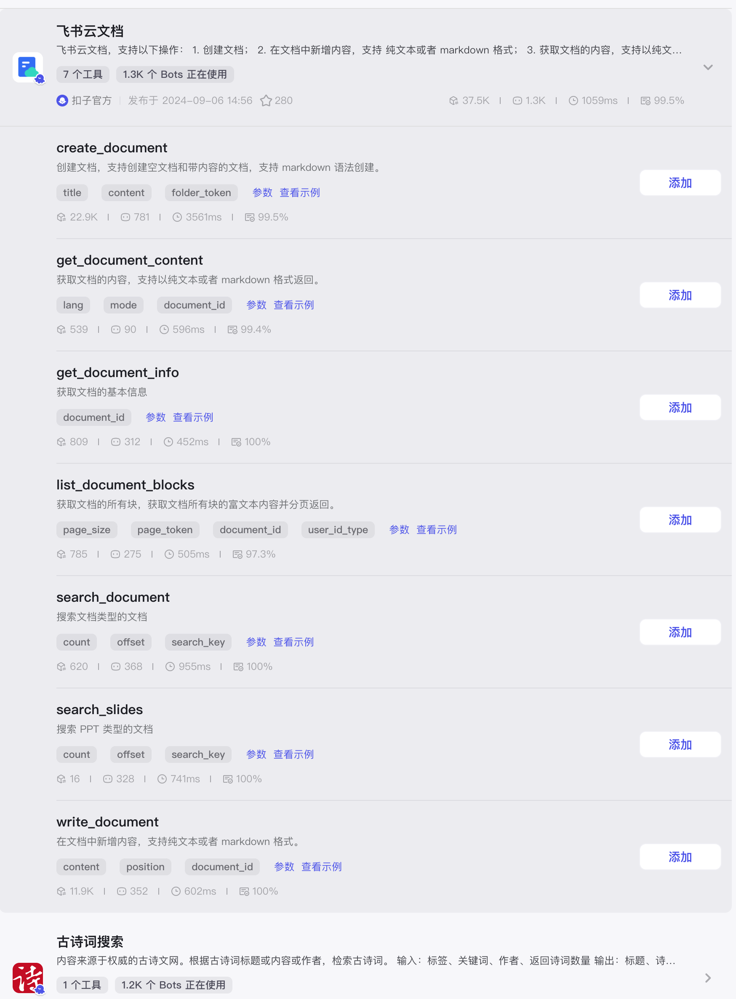
