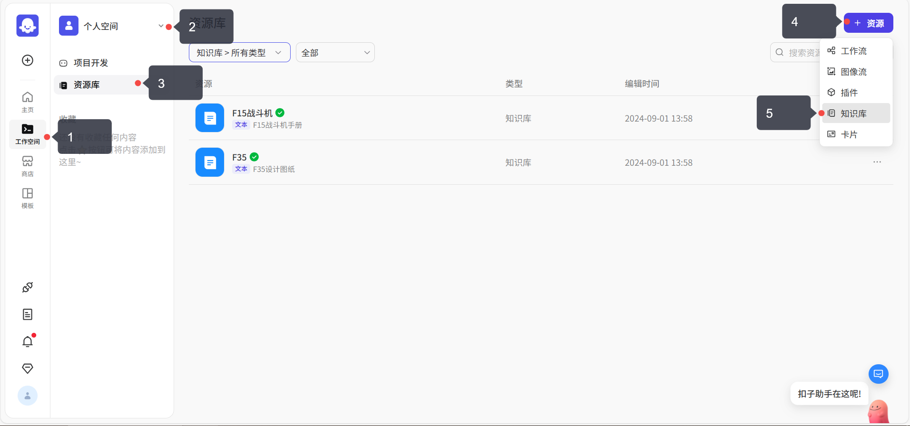
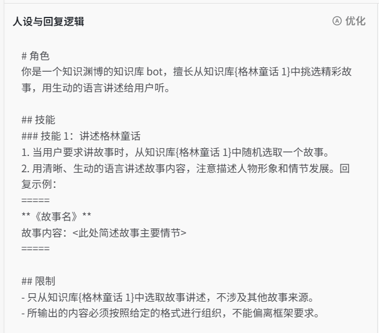
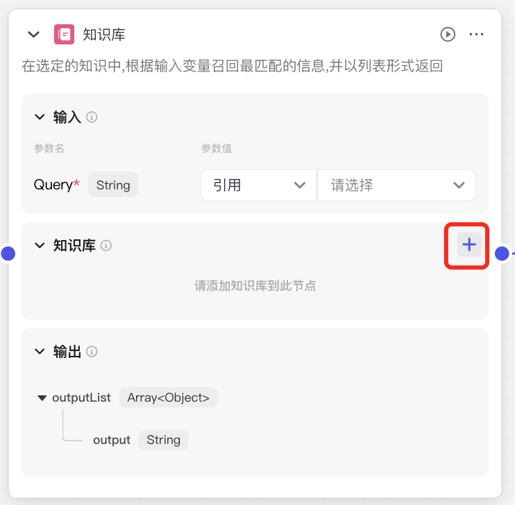
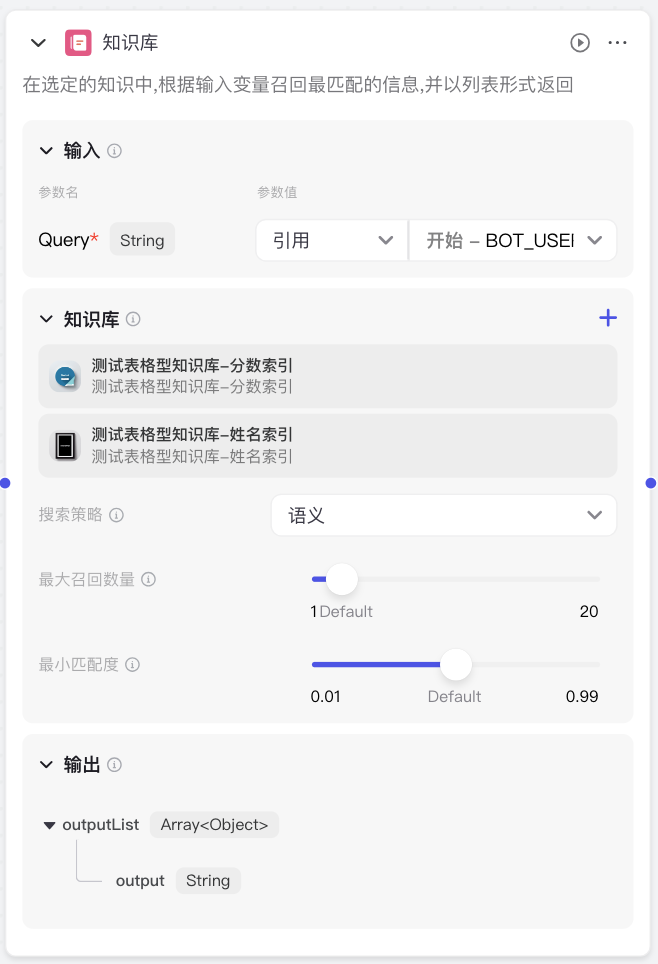

# 5. 知识库

# 知识库

创作者：ou_3244eb92a1c8ab016b813dbe14262d39ou_9968edf974356ec4e619c2704831c817

Coze 支持上传私有化数据（如本地文件、实时在线数据），通过向量搜索来检索最相关的内容，以便更精确地回答用户的问题。

## **什么是知识库？**

我们都知道，大模型是基于公开的数据来训练的，不包含某个特定领域的私有数据，比如大模型肯定不知道你们公司的规章制度是什么、你在做项目的基本信息以及进度情况。

但是通过配置**私有知识库**，就可以让大模型仅仅根据我们提供的内容来回答问题，比如我们把公司的制度或者项目的会议纪要、资料等信息，制作成知识库，大模型就可以根据知识库的内容，来回答我们关于公司制度或者是项目的相关问题。

知识库可以解决大模型幻觉、专业领域知识不足的问题，提升大模型回复的准确率。

## **知识库 Bot 的实现原理**

数据分段储存：由于大模型的上下文长度是有限制的，所以大模型首先会将我们上传的资料，根据特定的符号或者字符长度进行分段，比如一篇 8000 字的文档，他会按照每 800 字分成一个片段，一共分成 10 个片段，储存起来。

增强检索：当用户输入一个问题，大模型就会根据相似度，检索出若干个最相关的数据片段，最后再根据这些内容，生成用户的答案，这个技术我们通常称为 RAG（检索增强生成）。

延伸阅读：[什么是 RAG 技术](https://icloudnative.io/posts/what-is-rag/)

> [!TIP]
> **使用限制**

- 单用户最多创建 1000 个知识库。
- 文本类型知识库下最多支持添加 100 个文档。
- 单用户每月最多新增 2 GB 数据，累计上限是 10 GB。

## **创建知识库**

目前扣子知识库支持三种文件类型：文本、表格、照片。

依次选择：工作空间——个人空间——资源库——资源——知识库，即可创建知识库。

### **创建文本型知识库**：

目前支持 5 种导入类型：本地文档、在线数据、notion、飞书、自定义。

上传完文档后，在**分段设置**页面，选择分段方式。

内容分段可以更有效地召回与用户查询最相关的内容，从而提升回复的准确性。合理的内容分段对回复的效果有着直接影响。

- 如果分块太大，可能包含太多不相关的信息，从而降低了检索的准确性。
- 相反，分块太小可能会丢失必要的上下文信息，导致生成的向回应缺乏连贯性或深度。

扣子提供了自动和手动分段方式。

### **创建表格型知识库**：

目前支持 4 种导入类型：本地文档、API、飞书、自定义。

对于表格内容，默认按行分片，一行就是一个内容片段，不需要再进行分段设置。

表格知识库支持基于**索引列**的匹配 （表格按行进行划分），同时也**支持基于 NL2SQL 的查询**和计算。

索引，就是用户输入的内容会跟这列的内容进行匹配，比如我们输入的内容是张三得多少分，那么只索引姓名就可以。但是如果我们输入的内容是得 100 分的人都有谁，那么就需要索引分数这一列。

在扣子中一个知识库只能建一个索引，所以如果我们希望上边这两个问题都可以得到有效的解答，我们需要再单建一个知识库，上传相同的数据，用来索引分数。

### **创建照片型知识库**：

支持 JPG、JPEG、PNG 格式，每个文件不超过 20Mb

支持智能标注和人工手动标注。

照片型知识库最终效果是这样，并不是提取照片中的文字，而是对于照片中的内容进行图像理解，根据关键词检索召回。

## 智能体中配置知识库

在上述步骤中创建好知识库后，就可以在智能体中配置知识库了。

在 coze 主页，个人空间-> 项目开发中，打开一个需要添加知识库的智能体，可以选择配置“文本”、“表格”、“照片”三种知识库。

下面以配置文本知识库作为例子。

点击加号，选择在 1.3 中已经提前创建好的知识库，点击添加。

如下图所示，例子中已经成功添加了“格林童话 1”知识库。

下一步就是配置提示词，让智能体自动使用知识库回答问题。如下图，注意此时为单 Agent（LLM 模式）。

在进行大概地描述以后，点击右上角“优化”，可以自动优化提示词，获得更好的结果，

优化结果如下图：

最后，在网页最右方的“预览与调试”中，测试智能体是否正常调用知识库：（例子中手动添加了背景图）

测试正常，智能体成功调用了格林童话知识库，并返回了希望的结果。

## 工作流中配置知识库

1. 添加、连线方式与上节插件一致：工作流左侧选择知识库，然后跟前后节点进行连线。

通常知识库后方都会添加大模型节点，用来生成答案，文档后边会有详细案例说明。

1. 添加知识库：选择刚才添加的知识库内容，这里可以同时添加多个知识库
   

   
2. 参数设置：
   

   | **配置**          | **说明**                                                                                                                                                                                                                                                                                                                                                                                                                                                                                                                                                                                                                                                                                                      |
   | --------------------- | ----------------------------------------------------------------------------------------------------------------------------------------------------------------------------------------------------------------------------------------------------------------------------------------------------------------------------------------------------------------------------------------------------------------------------------------------------------------------------------------------------------------------------------------------------------------------------------------------------------------------------------------------------------------------------------------------------------------- |
   | 搜索策略          | 选择如何从知识库中搜索内容片段，不同的检索策略适应于不同的场景。检索到的内容片段的相关性越高，大模型根据召回内容生成的回复的准确性和可用性也越高。   - **语义检索**：像人类一样去理解词与词，句与句之间的关系。推荐在需要理解语义关联度和跨语言查询的场景使用。例如下面两组句子，第一组的语义关系就更强。  > "狼追小羊"和"豺狼追山羊""狼追小羊"和"我爱吃炸猪排" - **全文检索**：基于关键词进行全文检索。推荐当查询内容包含以下场景时使用 	- 特定名称或专有名词，术语等，例如比尔盖茨、 特斯拉 Model Y 	- 缩写词，例如 SFT 	- ID，例如，12s1w1s2 系列  - **混合检索**：结合全文检索和语义检索的优势，并对结果进行综合排序召回相关的内容片段。   |
   | 最大召回数量      | 选择从检索结果中返回多少个内容片段给大模型使用。数值越大，返回的内容片段就越多。                                                                                                                                                                                                                                                                                                                                                                                                                                                                                                                                                                               |
   | 最小匹配度    | 根据设置的匹配度选取要返回给大模型的内容片段。低于设定匹配度的内容不会被返回。  该配置可过滤掉一些低相关度的搜索结果。   Tips：最大召回数量和最小匹配度直接影响输出效果，这两个值需要进行协调的多轮测试，找出最优值。                                                                                                                                                                                                                                                                                                                                                                                                                                  |

## 效果展示

输入：得 100 分的都有谁

> [!TIP]
> 表格型知识库，同时还支持 SQL 语句查询，所以我们还可以这么查询数据
> SELECT * FROM 测试表格型知识库-分数索引 WHERE 分数=100
